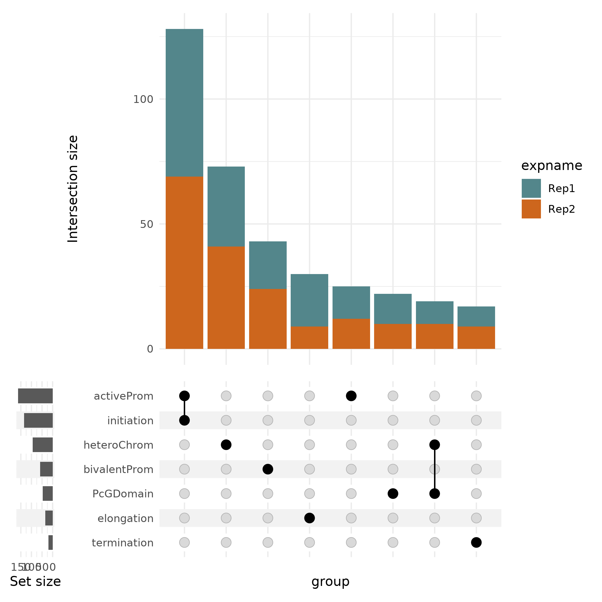

# Pan-O-GlcNac Cut&Run in non-repetitive DNA in mouse ES cells

## Description

Upset plot of the location of O-GlcNac Cut&Run peaks (replicates 1/2) in functional genomic compartments: Active promoters (79/84 peaks), Transcription Initiation (64/71 peaks), Heterochromatin (42/52 peaks), Bivalent Promoters (29/30 peaks), PcG (polycombs) Domains (24/23 peaks), Transcription Elongation (23/12 peaks), and Transcription Termination (9/11 peaks). O-GlcNac preferentially occupies active promoters at the transcription initiation sites.

## Details

The genomic compartments were defined as follows:

1) Active promoter: K27ac peaks in TSS-/+1Kb.
2) Transcription initiation: TSS-1/+1kb overlapping with Ser5P peaks.
3) Heterochromatin: H3K9me3 peak intervals.
4) Bivalent promoters: H3K4me3/H3K27me3 peaks overlapping TSS-/+1Kb. 
5) Polycomb domain: Suz12 and RING1B peaks overlapping each other.
6) Transcription elongation: TSS+1kb to TES overlapping Ser2P peaks.
7) Transcription termination: TES+50bp intervals.

## Data

The processed data to use in the script can be downloaded from:

```
#!/bin/bash

mkdir annotations
mkdir data

# gencode, refgene, refseq annotations
wget XXX/gencode.vM25.annotation.gff -P annotations/
wget XXX/refGeneUCSC-mm10-March2021.gff -P annotations/
wget XXX/refseqNCBI-mm10-March2021.gff -P annotations/

# Histone marks
wget XXX/H3K27ac_SRX19148013_peaks_broadPeak.gff -P data/
wget XXX/H3K4me1_SRR5466745_peaks_broadPeak.gff -P data/
wget XXX/H3K27me3_SRR10032683_peaks_hiddendomains.gff -P data/
wget XXX/H3K4me3_SRX5382140_peaks_broadPeak.gff -P data/
wget XXX/H3K9me3_SRR925652_peaks_broadPeak.gff -P data/

# Polycomb marks
wget XXX/Suz12_SRR034190_peaks_broadPeak.gff -P data/
wget XXX/Ring1B_SRR10095137_peaks_narrowPeak.gff -P data/

# CTD marks
wget XXX/Ser5P_SRR391050_peaks_broadPeak.gff -P data/
wget XXX/Ser2P_SRR391039_peaks_broadPeak.gff -P data/

# ATAC-seq
wget XXX/ATAC_SRR5466767_peaks_narrow.gff -P data/

# O-GlcNac peak replicates
wget XXX/ESCHGGlcNAc_rep1.gff -P data/
wget XXX/ESCHGGlcNAc_rep2.gff -P data/

# O-GlcNac bigwig replicates
wget XXX/ESCHGGlcNAc_rep1.bw -P data/
wget XXX/ESCHGGlcNAc_rep2.bw -P data/
```


## Installation

Install conda following the instructions [here](https://conda.io/projects/conda/en/latest/user-guide/install/index.html). Using the reciepe given in [fig1A.yaml](fig1A.yaml), run:

```
conda env create -n fig1a --file ./fig1A.yml
conda activate fig1a
```

## Figure generation

Run the script [upsetgenomecomp.R](upsetgenomecomp.R) from the current folder, it uses the files downloaded in the subfolders `data/` and `annotations/`. From the terminal:

```
Rscript upsetgenomecomp.R
```

It should output the following numbers:

```
# Replicate 1
Performing overlap with each compartment
		 activeProm
		76/5371 compartments contain a peak
		 PcGDomain
		22/10515 compartments contain a peak
		 heteroChrom
		28/48747 compartments contain a peak
		 bivalentProm
		29/13237 compartments contain a peak
		 initiation
		62/3364 compartments contain a peak
		 elongation
		20/2455 compartments contain a peak
		 termination
		9/13962 compartments contain a peak

# Replicate 2
Performing overlap with each compartment
		 activeProm
		82/5371 compartments contain a peak
		 PcGDomain
		21/10515 compartments contain a peak
		 heteroChrom
		37/48747 compartments contain a peak
		 bivalentProm
		29/13237 compartments contain a peak
		 initiation
		70/3364 compartments contain a peak
		 elongation
		11/2455 compartments contain a peak
		 termination
		11/13962 compartments contain a peak
```

You should obtain the raw figure:




## Pre-processing

### Workflows

### ChIP-seq and CutnRun

Quality control was done with FastQC 0.11.9: `fastqc --outdir $outputfolder --threads $nbcpu --quiet --extract --kmers 7 -f 'fastq' $input.fastq.gz`.

Adapters and low quality reads were removed with trim-galore 0.4.3: `trim_galore --phred33 --quality 20 --stringency 1 -e 0.1 --length 20 --output_dir ./ $input.fastq.gz`.

Reads were aligned to mm10 with Bowtie 2.3.4.1 and the bam were sorted using Samtools 1.9:
single: `bowtie2 -p $nbcpu -x m.musculus/mm10/mm10 -U $input.fastq.gz --sensitive --no-unal 2> $log |  samtools sort -@$nbcpu -O bam -o $output.bam`
paired: `bowtie2 -p $nbcpu -x m.musculus/mm10/mm10 -1 $input1.fastq.gz -2 $input2.fastq.gz -I 0 -X 500 --fr --dovetail --sensitive --no-unal 2> $log  | samtools sort -@$nbcpu -O bam -o $output.bam`.

Only primary alignments were kept using Samtools: `samtools view -o $output.bam -h -b -q 20 -F 0x800 $input.bam`.

Reads not aligned to consensus chromosomes were excluded: `samtools view -o $output.bam -h -b $input.bam 'chr1' 'chr2' 'chr3' 'chr4' 'chr5' 'chr6' 'chr7' 'chr8' 'chr9' 'chr10' 'chr11' 'chr12' 'chr13' 'chr14' 'chr15' 'chr16' 'chr17' 'chr18' 'chr19' 'chrX' 'chrY'`.

### ATAC-seq

### Peak detection

!! Give macs2 commands and parameters

mouse/hiddenDomains/public_data/histones_marks/300/Bell-H3K27me3rep1-input1_vis.gff
macs2/peak-calls/UniqueNoDupeShiftedNFR/narrow/ATACRep2_SRR466767_02.gff


| Target | Model | Broad | q-value | Duplicates Thres. | Tag size |
|--------|-------|-------|---------|-------------------|----------|
| H3K27ac | NO | YES | 0.04 |
| H3K4me1 | NO | YES | 0.04 |
mouse/HG/0.04/no_model_broad/H3K4me3_SRX5382140_peaks_broadPeak.gff
mouse/0.04/no_model_broad/Wysocka-Suz12-input2-single_SRR034190_peaks_broadPeak.gff
mouse/001/no_model/RING1B_peaks_narrowPeak.gff
mouse/0.04/no_model_broad/H3K9me3_SRR925652_peaks_broadPeak.gff
mouse/1e-04/no_model_broad/Pombo-RNAPIISer5P-rep2-input1-single_SRR391050_peaks_broadPeak.gff
mouse/0.03/no_model_broad/Pombo-RNAPIISer2P-input1tech3-single_SRR391039_peaks_broadPeak.gff
mouse/0.04/no_model/ESCHGGlcNAc1_lane1sample12_peaks_narrowPeak.gff
mouse/0.04/no_model/ESCHGGlcNAc2_lane1sample13_peaks_narrowPeak.gff
