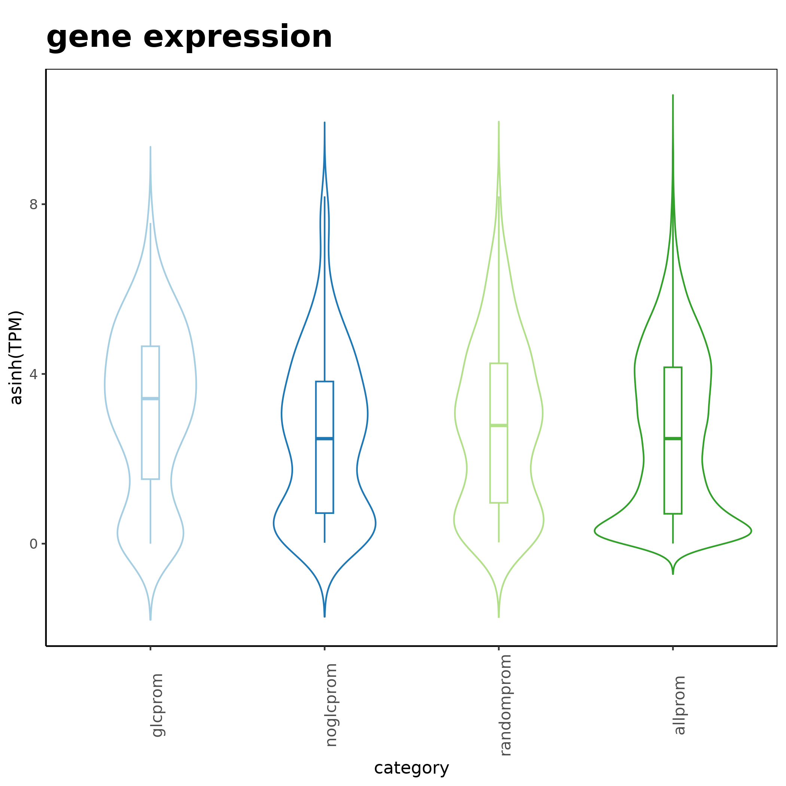

# Expression of O-GlcNac bound promoters

I. [Description](#description)  
II. [Data](#data)  
III. [Installation](#installation)  
IV. [Figure Generation](#figure-generation)  
V. [Pre-processing](#pre-processing)  

## Description

Violin plot showing the mouse ESC RNA-seq expression levels of O-GlcNAc enriched gene promoters (236 genes). The median expression of genes having O-GlcNac at promoters is higher when compared to 236 randomly selected promoters without O-GlcNac, 236 randomly selected promoters, and 21,085 promoters. The three groups to which O-GlcNac promoters are compared to have at least 1 RNA-seq read.

The statistical test used is a two-sided Mann-Whitney test (mu = 0, paired = FALSE) giving the p-value:

glcprom vs noglcprom: 0.000692837371518593
glcprom vs randomprom: 0.0356250808138736
glcprom vs allprom: 0.000158394211256996

## Data

Download the following data:

```
#!/bin/bash

mkdir data

# O-GlcNac peaks
wget XXX/ESCHGGlcNAc_rep1.gff -P data/

# RNA-seq counts and feature lengths
wget https://zenodo.org/records/12793186/files/ESCRNAseq_SRR11294181counts.txt -P data/
wget https://zenodo.org/records/12793186/files/ESCRNAseq_SRR11294181countslength.txt -P data/
```

## Installation

Install conda following the instructions [here](https://conda.io/projects/conda/en/latest/user-guide/install/index.html). Using the recipe [fig1C.yml](fig1C.yml), run:

```
conda env create -n fig1c --file ./fig1c.yml
conda activate fig1c
```

## Figure Generation

Run the script [promexpression.R](promexpression.R) from the current folder, it uses the files downloaded in the subfolders `data/`. From the terminal:

```
Rscript promexpression.R
```

It should output:

```
Reading gene lengths
Reading counts and computing TPM
Retrieve the promoters coordinates
Filtering chromosomes
Reading the OGlcNac peaks
         Processing data/ESCHGGlcNAc_rep1.gff
Perform overlap between O-GlcNac peaks and promoters
# Attempt 1/5 # Connection to Ensembl ...
Connected with success.
# Attempt 1/5 # Retrieving information about genes from biomaRt ...
Information retrieved with success.
Making counts list with only expressed one
Processing rep1
Writing file
Saving 7 x 7 in image
Computing mann-whitney-wilcoxson on each violin
Writing file
```

You should obtain the raw figure:




## Pre-processing

### Workflows

### CutnRun

The pre-processing was performed with the Galaxy workflows [OGlcNac_ChIP-SeqSEmm10](../A/galaxy-workflows/Galaxy-Workflow-OGlcNac_ChIP-SeqSEmm10.ga).

Quality control was done with FastQC v0.11.9: `fastqc --outdir $outputfolder --threads $nbcpu --quiet --extract --kmers 7 -f 'fastq' $input.fastq.gz`.

Adapters and low quality reads were removed with trim-galore v0.4.3: `trim_galore --phred33 --quality 20 --stringency 1 -e 0.1 --length 20 --output_dir ./ $input.fastq.gz`.

Reads were aligned to mm10 with Bowtie 2.3.4.1 and the bam were sorted using samtools v1.9: `bowtie2 -p $nbcpu -x m.musculus/mm10/mm10 -U $input.fastq.gz --sensitive --no-unal 2> $log |  samtools sort -@$nbcpu -O bam -o $output.bam`

Only primary alignments were kept using samtools v1.9: `samtools view -o $output.bam -h -b -q 20 -F 0x800 $input.bam`.

Reads not aligned to consensus chromosomes were excluded with samtools v1.9: `samtools view -o $output.bam -h -b $input.bam 'chr1' 'chr2' 'chr3' 'chr4' 'chr5' 'chr6' 'chr7' 'chr8' 'chr9' 'chr10' 'chr11' 'chr12' 'chr13' 'chr14' 'chr15' 'chr16' 'chr17' 'chr18' 'chr19' 'chrX' 'chrY'`.

The peaks were obtained with Macs2 v2.2.7.1: `macs2 callpeak -t $input.bam -c $control.bam -n $expname --outdir $outfold -f BAM -g 1.87e9 -s 82 -q 0.04 --nomodel --extsize 150 --keep-dup 7`

### RNA-seq

The pre-processing was performed with the Galaxy workflows [

The file to compute the count tables can be downloaded from `wget https://zenodo.org/records/12793186/files/Mus_musculus.GRCm38.102.chr.gtf.tar.gz`


FastQC 0.11.9 was used for quality control: `fastqc --outdir $outfolder --threads $nbcpu --quiet --extract --kmers 7 -f 'fastq' input.fastq.gz`.

Adapters and low quality reads were removed with trim-galore 0.4.3: `trim_galore --phred33 --quality 20  --stringency 1 -e 0.1 --length 20 --output_dir ./ $input.fastq.gz`.

Alignment was performed with STAR 2.6.0b: `STAR --runThreadN $nbcpu --genomeLoad NoSharedMemory --genomeDir 'mm10/rnastar_index2/mm10/files' --readFilesIn $input.fastq.gz --readFilesCommand zcat --outSAMtype BAM SortedByCoordinate --outSAMattributes Standard --outSAMstrandField None --outFilterIntronMotifs RemoveNoncanonical --outFilterIntronStrands RemoveInconsistentStrands --outSAMunmapped None --outSAMprimaryFlag OneBestScore --outSAMmapqUnique "255" --outFilterType Normal --outFilterMultimapScoreRange "1" --outFilterMultimapNmax "10" --outFilterMismatchNmax "10" --outFilterMismatchNoverLmax "0.3" --outFilterMismatchNoverReadLmax "1.0" --outFilterScoreMin "0" --outFilterScoreMinOverLread "0.66" --outFilterMatchNmin "0" --outFilterMatchNminOverLread "0.66" --outSAMmultNmax "-1" --outSAMtlen "1" --outBAMsortingBinsN "50"`.

Counts were obtained with subread v2.0.1: `featureCounts -a Mus_musculus.GRCm38.102.chr.gtf -F GTF -o ESCRNAseq_SRR11294181counts.txt -T $nbcpu -s 0 -Q 0 -t 'exon' -g 'gene_id' --minOverlap 1 --fracOverlap 0 --fracOverlapFeature 0 -C input.bam`.
