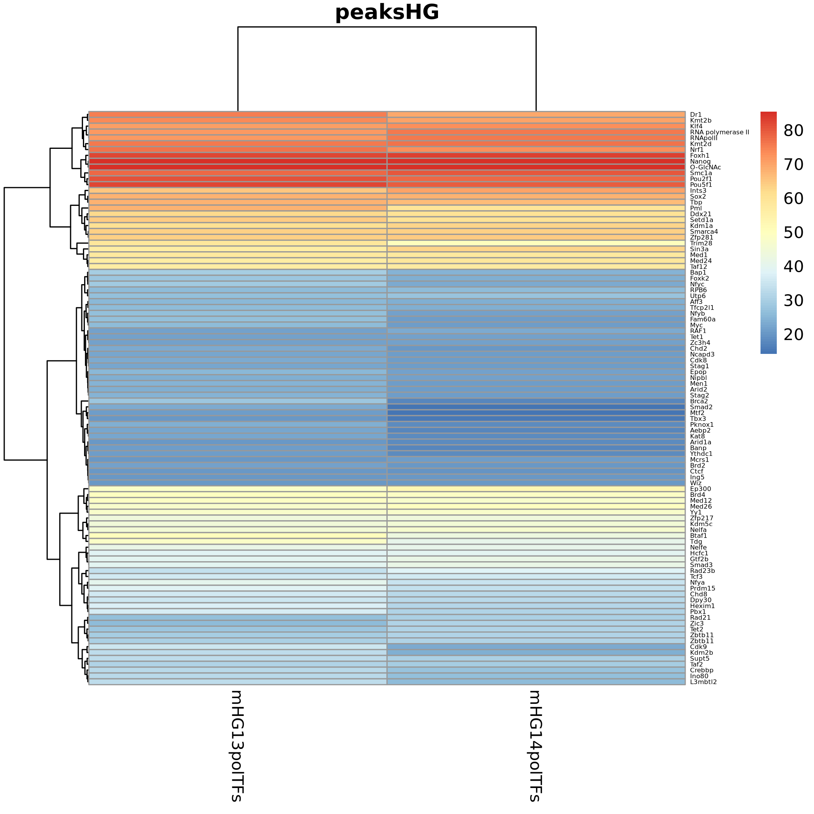

# Heatmap of the percentage of overlap of the ChIP-Atlas candidates with O-GlcNac peaks in mouse ESC

I. [Description](#description)  
II. [Details](#details)  
III. [Data](#data)  
IV. [Installation](#installation)  
V. [Figure Generation](#figure-generation)  
VI. [Pre-processing](#pre-processing)  
&nbsp;&nbsp; VI.I. [Workflows](#workflows)  
&nbsp;&nbsp;&nbsp;&nbsp;&nbsp;&nbsp; VI.I.I. [CutnRun](#cutnrun)  

## Description

The 527 and 523 O-GlcNac peaks were submitted to the [ChIP-Atlas](https://chip-atlas.org/) database to find overlap with ChIP-seq experiments using the [enrichment analysis](https://chip-atlas.org/enrichment_analysis) tool. The online tool is rapidly evolving and new experiments regularly added to [GEO](https://www.ncbi.nlm.nih.gov/geo/). We provide the results of the enrichment analysis in the folder [chipatlas_results](chipatlas_results/).

O-GlcNac peaks mainly overlap with RNA Polymerase II (RNAPol II) and associated factors: [TBP](https://www.genecards.org/cgi-bin/carddisp.pl?gene=TBP), [Taf12](https://www.genecards.org/cgi-bin/carddisp.pl?gene=TAF12&keywords=Taf12), [NelfA](https://www.genecards.org/cgi-bin/carddisp.pl?gene=NELFA&keywords=nelfa), [Med1](https://genecards.org/cgi-bin/carddisp.pl?gene=MED1&keywords=Med1), [Med12](https://www.genecards.org/cgi-bin/carddisp.pl?gene=MED12&keywords=med12), [Med24](https://www.genecards.org/cgi-bin/carddisp.pl?gene=MED24&keywords=med24), [Med26](https://www.genecards.org/cgi-bin/carddisp.pl?gene=MED26&keywords=med26), and [Dr1](https://www.genecards.org/cgi-bin/carddisp.pl?gene=DR1&keywords=dr1). TBP (TATA-binding proteins) is part of the General Transcription Factor IID that coordinates the binding of RNAPol II to the core promoter. Taf12 directly interacts with TBP. NelfA (Negative Elongation Factor Complex Member A) is part of the NELF complex that regulates transcription elongation by RNAPol II. Med1, Med12, Med24, and Med26 are subunits of the Mediator Complex which, after its recruitment to the promoters, serves as a scaffold for the assembly of the RNA PolII pre-initiation complex. Dr1 (Down-Regulator Of Transcription 1) represses both basal and activated levels of transcription by RNAPol II via its interaction with TBP. Other proteins that are known to carry O-GlcNac are highlighted in green.

## Details

The results given by ChIP-Atlas are not manually curated. We manually identified the following problematic datasets:

See [problematic-rep1.txt](replacement-files/problematic-rep1.txt) and [problematic-rep2.txt](replacement-files/problematic-rep2.txt)

These datasets were replaced by the following valid one which were found in the sorted lists of the scripts. In other words, we looked manually for the next candidates that had a lower overlap (but still > 20%). NA means that no suitable candidate was found:

See [replacement-rep1.txt](replacement-files/replacement-rep1.txt) and [replacement-rep2.txt](replacement-files/replacement-rep2.txt)

## Data

As explained in the description section, The online tool is rapidly evolving and new experiments are regularly added [GEO](https://www.ncbi.nlm.nih.gov/geo/). We provide the results of the enrichment analysis in the folder [chipatlas_results](chipatlas_results/).

If one whishes to obtain results with the updated database, the O-GlcNac peaks can be obtained at:

```
#!/bin/bash

mkdir data

# O-GlcNac peaks
wget https://www.ebi.ac.uk/biostudies/files/E-MTAB-14308/ESCHGGlcNAc_rep1_peaks.gff -P data/
wget https://www.ebi.ac.uk/biostudies/files/E-MTAB-14308/ESCHGGlcNAc_rep2_peaks.gff -P data/
```

## Installation

Install conda following the instructions [here](https://conda.io/projects/conda/en/latest/user-guide/install/index.html). Using the recipe [fig1C.yml](fig1c.yml), run:

```
conda env create -n fig1d --file ./fig1D.yml
conda activate fig1d
```

## Figure Generation

Run the command:

```
Rscript heatmap-chipatlas.R
```

The script should output:

```
## PART 1: Preparing the data
Reading ChIP-Atlas results
Reading mHG1hist
  Filtering lines having more overlap on random control
  Filtering on the Qvalue
  Filtering out the mock IP expriments
  Keeping 7300/7330(100%)
Reading mHG1pol
  Filtering lines having more overlap on random control
  Filtering on the Qvalue
  Filtering out the mock IP expriments
  Keeping 774/776(100%)
Reading mHG1TF
  Filtering lines having more overlap on random control
  Filtering on the Qvalue
  Filtering out the mock IP expriments
  Keeping 6772/6784(100%)
Reading mHG1hist
  Filtering lines having more overlap on random control
  Filtering on the Qvalue
  Filtering out the mock IP expriments
  Keeping 7301/7330(100%)
Reading mHG2pol
  Filtering lines having more overlap on random control
  Filtering on the Qvalue
  Filtering out the mock IP expriments
  Keeping 774/776(100%)
Reading mHG2TF
  Filtering lines having more overlap on random control
  Filtering on the Qvalue
  Filtering out the mock IP expriments
  Keeping 6779/6785(100%)
Nothing to remove.
Retrieving the number of peaks per categories
mHG1hist  mHG1pol   mHG1TF mHG2hist  mHG2pol   mHG2TF
      523       523       523      1074      1074      1074
Retrieving embryonic stem cells
         Number of results for mHG13hist: 5594
         Number of results for mHG13pol: 658
         Number of results for mHG13TF: 5356
         Number of results for mHG14hist: 5595
         Number of results for mHG14pol: 658
         Number of results for mHG14TF: 5363
Nothing to remove.
Building antigen unique lists for Embryonic Stem Cells:
Processing mHG1hist
         Keeping 1618/5594
         Keeping max overlap by antigens
         Returning 27/1618
Processing mHG1pol
         Keeping 302/658
         Keeping max overlap by antigens
         Returning 1/302
Processing mHG1TF
         Keeping 840/5356
         Keeping max overlap by antigens
         Returning 141/840
Processing mHG2hist
         Keeping 1508/5595
         Keeping max overlap by antigens
         Returning 26/1508
Processing mHG2pol
         Keeping 296/658
         Keeping max overlap by antigens
         Returning 1/296
Processing mHG2TF
         Keeping 759/5363
         Keeping max overlap by antigens
         Returning 130/759
Processing mHG2hist
         Keeping 5594/5594
         Computing percentages only
         Returning 5594/5594
Processing mHG2pol
         Keeping 658/658
         Computing percentages only
         Returning 658/658
Processing mHG2TF
         Keeping 5356/5356
         Computing percentages only
         Returning 5356/5356
Processing mHG2hist
         Keeping 5550/5595
         Computing percentages only
         Returning 5550/5550
Processing mHG2pol
         Keeping 654/658
         Computing percentages only
         Returning 654/654
Processing mHG2TF
         Keeping 5337/5363
         Computing percentages only
         Returning 5337/5337
Merging pol and TFs for each replicates
         Processing mHG13
         Processing mHG14
         Processing mHG13
         Processing mHG14

## PART 2: Filtering the data
Retrieve information from the manual curation
Replacing values
         Processing mHG1
                 Elements: mHG1hist
                 Elements: mHG1polTFs
         Processing mHG2
                 Elements: mHG2hist
                 Elements: mHG2polTFs

## PART 3: Generating the heatmap
Generating heatmap for PolII-TFs
         Retrieving all
                 Extracting mHG1polTFs from mHG1
                 Extracting mHG2polTFs from mHG2
Completing missing data for mHG1polTFs from mHG1
                 The missing data are RNApolII-Kdm2b-Ints3 having sra SRX8556273-SRX191070-SRX11677012
                         Complementary sra found
                         Complementary sra found
                         Complementary sra found
         Completing missing data for mHG2polTFs from mHG14
                 The missing data are RNA polymerase II-Aebp2-Arid1a-Kat8-Mtf2-Pknox1-Smad2-Tbx3-Ythdc1 having sra SRX8556273-SRX1829032-SRX4506772-SRX142127-SRX7423745-SRX759626-SRX12702093-SRX248284-SRX8722031
                         Complementary sra found
                         Complementary sra found
                         Complementary sra found
                         Complementary sra found
                         Complementary sra found
                         Complementary sra found
                         Complementary sra found
                         Complementary sra found
                         Complementary sra found
        Merging replicates and create result table
        Writing output table result
        Plotting to result
```

You should obtain the raw figure:




## Pre-processing

### Workflows

#### CutnRun

The pre-processing was performed with the Galaxy workflows [OGlcNac_ChIP-SeqSEmm10](../A/galaxy-workflows/Galaxy-Workflow-OGlcNac_ChIP-SeqSEmm10.ga). The .ga file can be imported in your own galaxy account.

Quality control was done with FastQC v0.11.9: `fastqc --outdir $outputfolder --threads $nbcpu --quiet --extract --kmers 7 -f 'fastq' $input.fastq.gz`.

Adapters and low quality reads were removed with trim-galore v0.4.3: `trim_galore --phred33 --quality 20 --stringency 1 -e 0.1 --length 20 --output_dir ./ $input.fastq.gz`.

Reads were aligned to mm10 with Bowtie 2.3.4.1 and the bam were sorted using samtools v1.9: `bowtie2 -p $nbcpu -x m.musculus/mm10/mm10 -U $input.fastq.gz --sensitive --no-unal 2> $log |  samtools sort -@$nbcpu -O bam -o $output.bam`

Only primary alignments were kept using samtools v1.9: `samtools view -o $output.bam -h -b -q 20 -F 0x800 $input.bam`.

Reads not aligned to consensus chromosomes were excluded with samtools v1.9: `samtools view -o $output.bam -h -b $input.bam 'chr1' 'chr2' 'chr3' 'chr4' 'chr5' 'chr6' 'chr7' 'chr8' 'chr9' 'chr10' 'chr11' 'chr12' 'chr13' 'chr14' 'chr15' 'chr16' 'chr17' 'chr18' 'chr19' 'chrX' 'chrY'`.

The peaks were obtained with Macs2 v2.2.7.1: `macs2 callpeak -t $input.bam -c $control.bam -n $expname --outdir $outfold -f BAM -g 1.87e9 -s 82 -q 0.04 --nomodel --extsize 150 --keep-dup 7`

