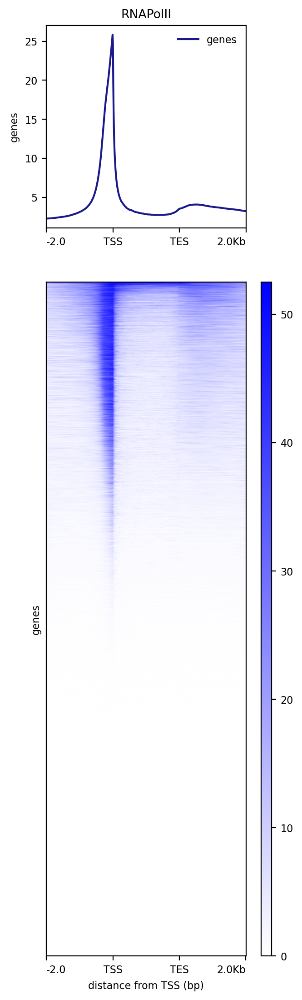
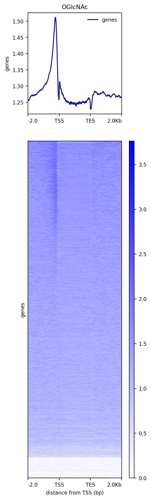

# RNA Polymerase II and O-GlcNac co-localize at gene promoters in mouse ES cells

I. [Description](#description)  
II. [Data](#data)  
III. [Installation](#installation)  
IV. [Figure Generation](#figure-generation)  
V. [Pre-processing](#pre-processing)  
&nbsp;&nbsp; V.I. [Data](#data-1)  
&nbsp;&nbsp; V.II. [Workflow](#workflow)  

## Description

The heatmap of binding values of RNA Polymerase II and O-GlcNac shows a global colocalization at the 55,634 Ensembl genes.

## Data

```
#!/bin/bash

mkdir data

## Bigwig files used to generate the heatmap
wget https://www.ebi.ac.uk/biostudies/files/E-MTAB-14308/ESCHGGlcNAc_rep1.bw  -P data/
wget https://zenodo.org/records/12793186/files/RNApolymeraseII_SRX8556273.bw  -P data/

## Ensembl annotations
wget https://github.com/descostesn/chromglycomethods/raw/main/figure1/E/annotations/ensemblmm10.tar.gz -P data/ &&
 cd data/ && tar -xvzf ensemblmm10.tar.gz && rm ensemblmm10.tar.gz && cd ..
```

## Installation

Install conda following the instructions [here](https://conda.io/projects/conda/en/latest/user-guide/install/index.html). Using the recipe [fig1E.yml](fig1E.yml), run:

```
conda env create -n fig1e --file ./fig1E.yml
conda activate fig1e
```

## Figure generation

Generate a matrix with the RNAPol II bigwig using the coordinates of the Ensembl genes and plot a heatmap in descending order (deeptools v3.5.5):

```
#!/bin/bash

mkdir results

## Define the number of CPUs
NBCPU=1

## Build the deeptools matrix
computeMatrix scale-regions --regionsFileName data/ensemblmm10.bed --scoreFileName data/RNApolymeraseII_SRX8556273.bw --outFileName results/polII.mat --samplesLabel RNAPol_II --numberOfProcessors $NBCPU --regionBodyLength 2000 --beforeRegionStartLength 2000 --afterRegionStartLength 2000 --unscaled5prime 0 --unscaled3prime 0

## Plot the RNAPol II signal using decreasing sorting
FILENAME="heatmap_polII.png"

plotHeatmap --matrixFile results/polII.mat --outFileName results/$FILENAME --plotFileFormat 'png' --outFileSortedRegions results/peakscoord-fig1E.bed --dpi '200' --sortRegions 'descend' --sortUsing 'mean' --averageTypeSummaryPlot 'mean' --plotType 'lines' --missingDataColor 'black' --alpha '1.0' --colorList white,blue --xAxisLabel 'distance from TSS (bp)' --yAxisLabel 'genes' --heatmapWidth 7.5 --heatmapHeight 25.0 --whatToShow 'plot, heatmap and colorbar' --startLabel 'TSS' --endLabel 'TES' --refPointLabel 'TSS' --samplesLabel RNAPolII --legendLocation 'best' --labelRotation '0'
```

You should obtain the raw figure:



Using the sorted peak coordinates `peakscoord-fig1E.bed`, generate a matrix of O-GlcNac signal:

```
computeMatrix scale-regions --regionsFileName results/peakscoord-fig1E.bed --scoreFileName data/ESCHGGlcNAc_rep1.bw --outFileName results/OGlcNac.mat --samplesLabel Glc --numberOfProcessors $NBCPU --regionBodyLength 2000 --beforeRegionStartLength 2000 --afterRegionStartLength 2000  --unscaled5prime 0 --unscaled3prime 0
```

The matrix is already sorted because it followed the order of `peakscoord-fig1E.bed`. Remains plotting the signal without performing sorting:

```
FILENAME="heatmap_OGlcNac.png"

plotHeatmap --matrixFile results/OGlcNac.mat --outFileName results/$FILENAME  --plotFileFormat 'png' --dpi '200' --sortRegions 'no' --sortUsing 'mean' --averageTypeSummaryPlot 'mean' --plotType 'lines' --missingDataColor 'black' --alpha '1.0' --colorList white,blue --xAxisLabel 'distance from TSS (bp)' --yAxisLabel 'genes' --heatmapWidth 7.5 --heatmapHeight 25.0 --whatToShow 'plot, heatmap and colorbar' --startLabel 'TSS' --endLabel 'TES' --refPointLabel 'TSS' --samplesLabel OGlcNAc --legendLocation 'best' --labelRotation '0'
```

You should obtain the following heatmaps:




## Pre-processing

### Data

| Target | ID | library layout | link |
|--------|----|----------------|------|
| O-GlcNAc rep1 | E-MTAB-14308 | single | ftp://ftp.sra.ebi.ac.uk/vol1/fastq/ERR134/033/ERR13430733/ERR13430733.fastq.gz |
| RNApolymeraseII | SRX8556273 | single | see the provided [snakemake](../F/snakemake/Snakefile) (technical replicates) | 

### Workflow

The pre-processing was performed with the Galaxy workflow [OGlcNac_ChIP-SeqSEmm10](../A/galaxy-workflows/Galaxy-Workflow-OGlcNac_ChIP-SeqSEmm10.ga). The .ga files can be imported in one own galaxy account.

Quality control was done with FastQC v0.11.9: `fastqc --outdir $outputfolder --threads $nbcpu --quiet --extract --kmers 7 -f 'fastq' $input.fastq.gz`.

Adapters and low quality reads were removed with trim-galore v0.4.3: `trim_galore --phred33 --quality 20 --stringency 1 -e 0.1 --length 20 --output_dir ./ $input.fastq.gz`.

Reads were aligned to mm10 with Bowtie 2.3.4.1 and the bam were sorted using samtools v1.9: `bowtie2 -p $nbcpu -x m.musculus/mm10/mm10 -U $input.fastq.gz --sensitive --no-unal 2> $log |  samtools sort -@$nbcpu -O bam -o $output.bam`

Only primary alignments were kept using samtools v1.9: `samtools view -o $output.bam -h -b -q 20 -F 0x800 $input.bam`.

Reads not aligned to consensus chromosomes were excluded with samtools v1.9: `samtools view -o $output.bam -h -b $input.bam 'chr1' 'chr2' 'chr3' 'chr4' 'chr5' 'chr6' 'chr7' 'chr8' 'chr9' 'chr10' 'chr11' 'chr12' 'chr13' 'chr14' 'chr15' 'chr16' 'chr17' 'chr18' 'chr19' 'chrX' 'chrY'`.

Duplicates were removed with picard v2.18.2: `picard MarkDuplicates INPUT=$input.bam OUTPUT=$output.bam METRICS_FILE=$metrics.txt REMOVE_DUPLICATES='true' ASSUME_SORTED='true'  DUPLICATE_SCORING_STRATEGY='SUM_OF_BASE_QUALITIES' OPTICAL_DUPLICATE_PIXEL_DISTANCE='100' VALIDATION_STRINGENCY='LENIENT' QUIET=true VERBOSITY=ERROR`

Bigwig files normalized by the genome size were generated with deeptools v3.0.2:
single: `bamCoverage --numberOfProcessors $NBCPU --bam $input.bam --outFileName $output.bw --outFileFormat 'bigwig' --binSize 50 --normalizeUsing RPGC --effectiveGenomeSize 2308125349 --scaleFactor 1.0  --extendReads 150 --minMappingQuality '1'`
paired: `bamCoverage --numberOfProcessors $NBCPU --bam $input.bam --outFileName $output.bw --outFileFormat 'bigwig' --binSize 50 --normalizeUsing RPGC --effectiveGenomeSize 2308125349 --scaleFactor 1.0  --extendReads --minMappingQuality '1'`
