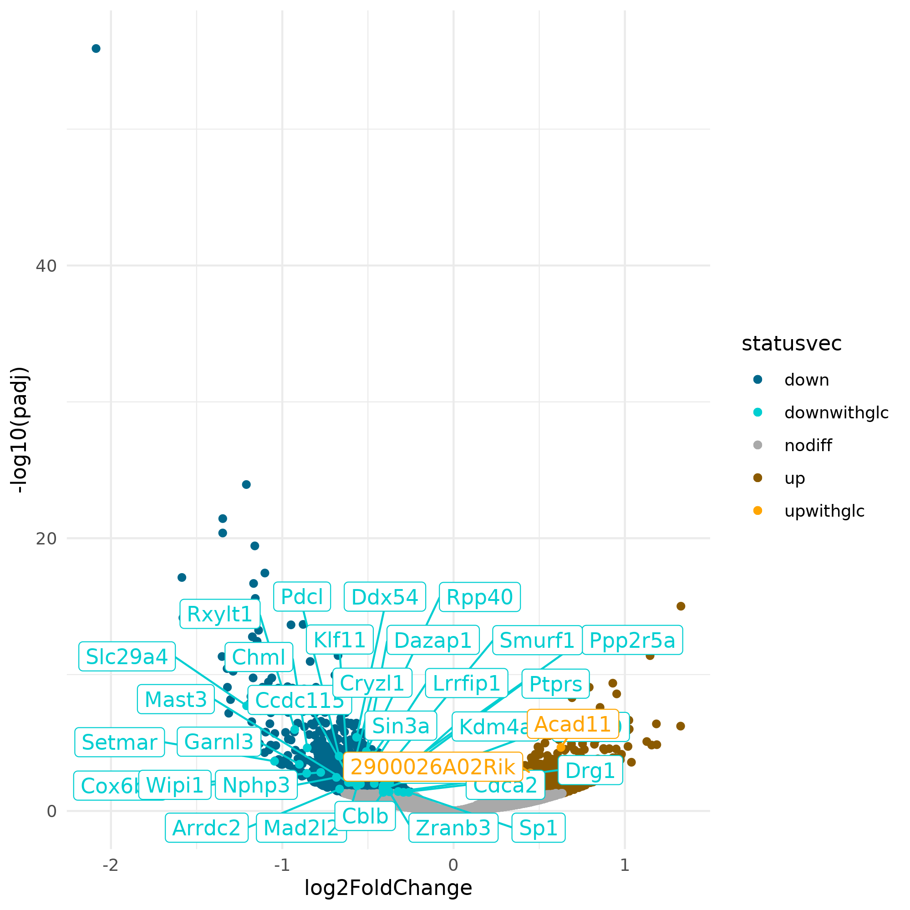

# Differentially expressed genes upon degradation of OGT by siRNA

I. [Description](#description)  
II. [Data](#data)  
III. [Installation](#installation)  
IV. [Figure Generation](#figure-generation)  
V. [Pre-processing](#pre-processing)  
&nbsp;&nbsp; V.I. [Workflows](#workflows)  
&nbsp;&nbsp;&nbsp;&nbsp;&nbsp;&nbsp; VI.I.I. [CutnRun](#cutnrun)  
&nbsp;&nbsp;&nbsp;&nbsp;&nbsp;&nbsp; VI.I.II. [RNA-seq](#rna-seq)  
&nbsp;&nbsp; V.II. [DEseq2](#deseq2)  
&nbsp;&nbsp; V.III. [Merging replicates](#merging-replicates)  
&nbsp;&nbsp; V.IV. [DEG overlap O-GlcNac](#deg-overlap-o-glcnac)  


## Description

Volcano plot indicating the differentially expressed genes upon degradation of OGT by siRNA in mouse ES cells. We found 867 down regulated (dark blue) and 594 upregulated genes (dark red). Among these, 44 down- and 12 up-regulated genes have a fold-change higher than two. 33 down- (light blue) and 2 up-regulated (orange) genes had an O-GlcNac peaks. Note that the differences with the numbers obtained with the script below are due to the conversion from ensembl to symbol.

## Data

```
#!/bin/bash

mkdir data

# The tabular file given by DEseq2
wget https://zenodo.org/records/12793186/files/resultDeseq2_siogt.txt  -P data/

## The down- and up-regulated genes having an O-GlcNac peak
wget https://zenodo.org/records/12793186/files/siogtdown_withOGlcNac.gff -P data/
wget https://zenodo.org/records/12793186/files/siogtup_withOGlcNac.gff  -P data/

# O-GlcNac peak replicates to perform merge
wget XXX/ESCHGGlcNAc_rep1.gff -P data/
wget XXX/ESCHGGlcNAc_rep2.gff -P data/

## Counts and feature length files for DESeq2
wget XXX/sictrl_rep1_countslength.txt -P data/
wget XXX/sictrl_rep1_counts.txt -P data/
wget XXX/sictrl_rep2_counts.txt -P data/
wget XXX/siogt_rep1_counts.txt -P data/
wget XXX/siogt_rep2_counts.txt -P data/

## All 'countslength' files contain the same information
mv sictrl_rep1_countslength.txt sictrlogt_featurelength.txt
```


## Installation

TO DO

## Figure generation

Run the command:

```
Rscript volcanosiogt.R
```

The script should output:

```
Reading files
Defining status
The number of genes per category is:
down    downwithglc     nodiff      up      upwithglc
836          31         53940       592           2
Plotting volcano
```

You should obtain the raw figure:




## Pre-processing

### Workflows

#### CutnRun

The pre-processing was performed with the Galaxy workflows [OGlcNac_ChIP-SeqSEmm10](../A/galaxy-workflows/Galaxy-Workflow-OGlcNac_ChIP-SeqSEmm10.ga). The .ga file can be imported in your own galaxy account.

Quality control was done with FastQC v0.11.9: `fastqc --outdir $outputfolder --threads $nbcpu --quiet --extract --kmers 7 -f 'fastq' $input.fastq.gz`.

Adapters and low quality reads were removed with trim-galore v0.4.3: `trim_galore --phred33 --quality 20 --stringency 1 -e 0.1 --length 20 --output_dir ./ $input.fastq.gz`.

Reads were aligned to mm10 with Bowtie 2.3.4.1 and the bam were sorted using samtools v1.9: `bowtie2 -p $nbcpu -x m.musculus/mm10/mm10 -U $input.fastq.gz --sensitive --no-unal 2> $log |  samtools sort -@$nbcpu -O bam -o $output.bam`

Only primary alignments were kept using samtools v1.9: `samtools view -o $output.bam -h -b -q 20 -F 0x800 $input.bam`.

Reads not aligned to consensus chromosomes were excluded with samtools v1.9: `samtools view -o $output.bam -h -b $input.bam 'chr1' 'chr2' 'chr3' 'chr4' 'chr5' 'chr6' 'chr7' 'chr8' 'chr9' 'chr10' 'chr11' 'chr12' 'chr13' 'chr14' 'chr15' 'chr16' 'chr17' 'chr18' 'chr19' 'chrX' 'chrY'`.

The peaks were obtained with Macs2 v2.2.7.1: `macs2 callpeak -t $input.bam -c $control.bam -n $expname --outdir $outfold -f BAM -g 1.87e9 -s 82 -q 0.04 --nomodel --extsize 150 --keep-dup 7`

#### RNA-seq

The pre-processing was performed with the Galaxy workflows [OGlcNac_RNASeqPE_mm10_STAR_bw](galaxy-workflow/Galaxy-Workflow-OGlcNac_RNASeqPE_mm10_STAR_bw.ga). The .ga file can be imported in your own galaxy account.

The file to compute the count tables can be downloaded from `wget https://zenodo.org/records/12793186/files/Mus_musculus.GRCm38.102.chr.gtf.tar.gz`

FastQC 0.11.9 was used for quality control: `fastqc --outdir $outfolder --threads $nbcpu --quiet --extract --kmers 7 -f 'fastq' input.fastq.gz`.

Adapters and low quality reads were removed with trim-galore 0.4.3: `trim_galore --phred33 --quality 20  --stringency 1 -e 0.1 --length 20 --output_dir ./ --paired $input_1.fastq.gz $input_2.fastq.gz`.

Alignment was performed with STAR 2.6.0b: `STAR --runThreadN $nbcpu --genomeLoad NoSharedMemory --genomeDir 'mm10/rnastar_index2/mm10/files' --readFilesIn $input_1.fastq.gz $input_2.fastq.gz --readFilesCommand zcat --outSAMtype BAM SortedByCoordinate --outSAMattributes Standard --outSAMstrandField None --outFilterIntronMotifs RemoveNoncanonical --outFilterIntronStrands RemoveInconsistentStrands --outSAMunmapped None --outSAMprimaryFlag OneBestScore --outSAMmapqUnique "255" --outFilterType Normal --outFilterMultimapScoreRange "1" --outFilterMultimapNmax "10" --outFilterMismatchNmax "10" --outFilterMismatchNoverLmax "0.3" --outFilterMismatchNoverReadLmax "1.0" --outFilterScoreMin "0" --outFilterScoreMinOverLread "0.66" --outFilterMatchNmin "0" --outFilterMatchNminOverLread "0.66" --outSAMmultNmax "-1" --outSAMtlen "1" --outBAMsortingBinsN "50"`

Counts were obtained with subread v2.0.1: `featureCounts -a Mus_musculus.GRCm38.102.chr.gtf -F GTF -o $outputcounts.txt -T $nbcpu -s 0 -Q 12 -t 'exon' -g 'gene_id' --minOverlap 1 --fracOverlap 0 --fracOverlapFeature 0 -C input.bam`.

### DEseq2

The analysis was done on Galaxy with the workflow !!

If one wants to run the complete workflow, the file that was used to annotate the genes can be downloaded from `wget https://zenodo.org/records/12793186/files/Mus_musculus.GRCm38.102.chr.gtf.tar.gz`

Differentially expressed genes were determined with bioconductor-deseq2 v1.22.1 (see the Galaxy script [deseq2.R](others/deseq2.R)]): `Rscript deseq2.R --cores $nbcpu -o results_deseq2.txt -p results_deseq2.pdf -n countfiles -H  -f '[["condition2_vs_condition1", [{"ctrl": ["sictrl_rep2_counts.txt", "sictrl_rep1_counts.txt"]}, {"siogt": ["siogt_rep1_counts.txt", "siogt_rep2_counts.txt"]}]]]' -l '{"siogt_rep1_counts.txt": "siogt_rep1_counts.txt", "siogt_rep2_counts.txt": "siogt_rep2_counts.txt", "sictrl_rep2_counts.txt": "sictrl_rep2_counts.txt", "sictrl_rep1_counts.txt": "sictrl_rep1_counts.txt"}' -t 1`

The deseq2 table was then filtered on columns 3 (fold-change) and 7 (adj p-val) with `abs(c3)>0 and c7<0.05` to keep significant fold-changes that are not equal to zero.

The lists of down- and up-regulated genes were separated to their respective files using the third column: c3 < 0 for down and c3 > 0 for up.

The resulting files can be downloaded:

```
#!/bin/bash

wget https://zenodo.org/records/12793186/files/log0_siogtdown-ensembl.gff
wget https://zenodo.org/records/12793186/files/log0_siogtup-ensembl.gff
```

### Merging replicates
### DEG overlap O-GlcNac

