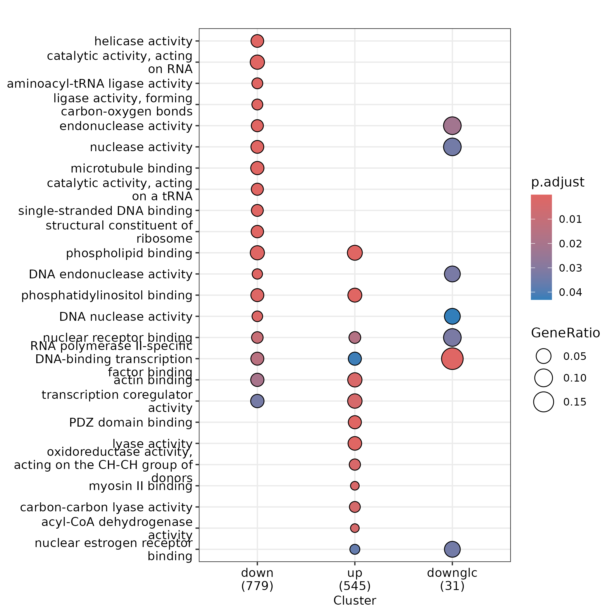

# Geneset enrichment analysis of differentially expressed genes in siOGT

I. [Description](#description)  
II. [Data](#data)  
III. [Installation](#installation)  
IV. [Figure Generation](#figure-generation)  
V. [Pre-processing](#pre-processing)  


## Description

On the 867 down- and 594 upregulated genes (see [fig2B](../B/README.md)), 779 down- and 545 upregulated genes were found to be enriched in functional categories. On the 33 down-regulated genes having an O-GlcNac peak, 31 were found in functional categories. Altered genes of the three groups (down, up, down-glc) appear to be coding for RNA Polymerase II-specific DNA-binding transcription factors.


## Data


```
#!/bin/bash

mkdir data
mkdir results

## The down- and up-regulated genes obtained with DESeq2
wget https://zenodo.org/records/12793186/files/log0_siogtdown-ensembl.gff -P data/
wget https://zenodo.org/records/12793186/files/log0_siogtup-ensembl.gff -P data/

## The down-regulated genes having an O-GlcNac peak
wget https://zenodo.org/records/12793186/files/siogtdown_withOGlcNac.gff -P data/

## The results given by cluster profiler (not needed to perform the analysis)
wget https://zenodo.org/records/12793186/files/fig2C_clusterprofiler.txt -P results/
```

## Installation


Install conda following the instructions [here](https://conda.io/projects/conda/en/latest/user-guide/install/index.html). Using the recipe [fig2D.yml](fig2D.yml), run:

```
conda env create -n fig2d --file ./fig2D.yml
conda activate fig2d
```


## Figure generation

Run the script:

```
Rscript enrichmentanalysis.R
```

The script should output:

```
Reading gff files and return conversion table
Defining background
### No background provided
Retrieving info from biomart
Connecting to biomart
# Attempt 1/5 # Connection to Ensembl ... 
Connected with success.
	 Retrieving gene info
# Attempt 1/5 # Retrieving information about genes from biomaRt ...
Information retrieved with success.
Filtering out non-canonical chromosomes from genesinfo
	 Removing 70/57186 annotations with non canonical chromosomes
Creating the input list of entrezID
Creating the entrezID-symbol table
Performing clusters comparison on molecular function
Output the dotplot of the comparison into results/
```

You should obtain the raw figure:




## Pre-processing

See [fig2B pre-processing section](../B#pre-processing)

