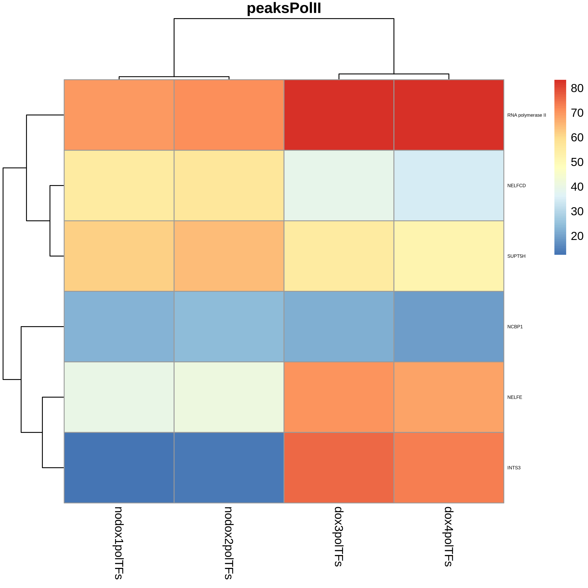

# Heatmap of the percentage of overlap of the ChIP-Atlas candidates with O-GlcNac peaks in mouse ESC

I. [Description](#description)  
II. [Details](#details)  
III. [Data](#data)  
IV. [Installation](#installation)  
V. [Figure Generation](#figure-generation)  
VI. [Pre-processing](#pre-processing)  
&nbsp;&nbsp; VI.I. [Workflows](#workflows)  
&nbsp;&nbsp;&nbsp;&nbsp;&nbsp;&nbsp; VI.I.I. [CutnRun](#cutnrun)  

## Description

The 3450 (nodox rep1), 4201 (nodox rep2), 2630 (dox rep1), and 1848 (dox rep2) O-GlcNac peaks were submitted to the [ChIP-Atlas](https://chip-atlas.org/) database to find overlap with ChIP-seq experiments using the [enrichment analysis](https://chip-atlas.org/enrichment_analysis) tool. The online tool is rapidly evolving and new experiments regularly added to [GEO](https://www.ncbi.nlm.nih.gov/geo/). We provide the results of the enrichment analysis in the folder [chipatlas_results](chipatlas_results/).

O-GlcNac peaks mainly overlap with RNA Polymerase II (RNAPol II) and associated factors: [Nelfcd](https://www.genecards.org/cgi-bin/carddisp.pl?gene=NELFCD), [Supt5h](https://www.genecards.org/cgi-bin/carddisp.pl?gene=SUPT5H), [Ncbp1](https://www.genecards.org/cgi-bin/carddisp.pl?gene=NCBP1), [Nelfe](https://www.genecards.org/cgi-bin/carddisp.pl?gene=NELFE), and [Ints3](https://www.genecards.org/cgi-bin/carddisp.pl?gene=INTS3).

The Nelf (negative elongation factor) complex interacts with DSIF to repress RNA Pol II from entering the elongation step of the transcriptional process. Nelfcd and Nelfe are subunits of NELF whereas Supt5h is a subunit of DSIF([[1](https://www.ncbi.nlm.nih.gov/pmc/articles/PMC5077205/), [2](https://www.biorxiv.org/content/10.1101/2020.01.23.917237v2), [3](https://www.ncbi.nlm.nih.gov/pmc/articles/PMC10906531/)]). Ints3 is a subunit of the Integrator complex that was shown to regulate transcription elongation and initiation[[4](https://pubmed.ncbi.nlm.nih.gov/25201415/)]. Ncbp1 is also involved in initiation and promotes high-affinity mRNA-cap binding and associates with the CTD of RNA polymerase II[[5](https://www.ncbi.nlm.nih.gov/pmc/articles/PMC10771035/)].

## Details

The results given by ChIP-Atlas are not manually curated. We manually identified the following problematic datasets:

See [problematic-nodoxrep1.txt](replacement-files/problematic-nodoxrep1.txt), [problematic-nodoxrep2.txt](replacement-files/problematic-nodoxrep2.txt), [problematic-doxrep1.txt](replacement-files/problematic-doxrep1.txt) and [problematic-doxrep2.txt](replacement-files/problematic-doxrep2.txt).

These datasets were replaced by the following valid one which were found in the sorted lists of the scripts. In other words, we looked manually for the next candidates that had a lower overlap (but still > 20%). NA means that no suitable candidate was found:

See [replacement-nodoxrep1.txt](replacement-files/replacement-nodoxrep1.txt), [replacement-nodoxrep2.txt](replacement-files/replacement-nodoxrep2.txt), [replacement-doxrep1.txt](replacement-files/replacement-doxrep1.txt) and [replacement-doxrep2.txt](replacement-files/replacement-doxrep2.txt).

## Data

As explained in the description section, The online tool is rapidly evolving and new experiments are regularly added [GEO](https://www.ncbi.nlm.nih.gov/geo/). We provide the results of the enrichment analysis in the folder [chipatlas_results](chipatlas_results/).

If one whishes to obtain results with the updated database, the O-GlcNac peaks can be obtained at:

```
#!/bin/bash

mkdir data

# O-GlcNac peaks
wget https://www.ebi.ac.uk/biostudies/files/E-MTAB-14307/DLD1GlcNAcDoxAux_rep1_peaks.gff -P data/
wget https://www.ebi.ac.uk/biostudies/files/E-MTAB-14307/DLD1GlcNAcDoxAux_rep2_peaks.gff -P data/
wget https://www.ebi.ac.uk/biostudies/files/E-MTAB-14307/DLD1GlcNAcNoDoxAux_rep1_peaks.gff -P data/
wget https://www.ebi.ac.uk/biostudies/files/E-MTAB-14307/DLD1GlcNAcNoDoxAux_rep2_peaks.gff -P data/
```

## Installation

Install conda following the instructions [here](https://conda.io/projects/conda/en/latest/user-guide/install/index.html). Using the recipe [fig4B.yml](fig4B.yml), run:

```
conda env create -n fig4B --file ./fig4B.yml
conda activate fig4B
```


## Figure Generation

Run the command:

```
Rscript heatmap-chipatlas.R
```

The script should output:

```
## PART 1: Preparing the data
Checking parameters
Reading ChIP-Atlas results
         Processing nodox1_histone
         Keeping 32042/32418(99%)
         Processing nodox1_pol
         Keeping 3767/3780(100%)
         Processing nodox1_TF
         Keeping 29531/29807(99%)
         Processing nodox2_pol
         Keeping 3759/3780(99%)
         Processing nodox2_TF
         Keeping 29517/29803(99%)
         Processing dox3_histone
         Keeping 32037/32420(99%)
         Processing dox3_pol
         Keeping 3763/3779(100%)
         Processing dox3_TF
         Keeping 29520/29804(99%)
         Processing dox4_histone
         Keeping 32030/32419(99%)
         Processing dox4_pol
         Keeping 3757/3779(99%)
         Processing dox4_TF
         Keeping 29527/29805(99%)
         Nothing to remove.


 Retrieving DLD-1 cells
         Number of results for nodox1_histone: 47
         Number of results for nodox1_pol: 284
         Number of results for nodox1_TF: 252
         Number of results for nodox2_pol: 284
         Number of results for nodox2_TF: 252
         Number of results for dox3_histone: 47
         Number of results for dox3_pol: 284
         Number of results for dox3_TF: 252
         Number of results for dox4_histone: 47
         Number of results for dox4_pol: 284
         Number of results for dox4_TF: 252
         Nothing to remove.
Building antigen unique lists for DLD-1 Cells:
         Processing nodox1_histone
                 Keeping 18/47
                         Keeping max overlap by antigens
                 Returning 2/18
         Processing nodox1_pol
                 Keeping 217/284
                         Keeping max overlap by antigens
                 Returning 1/217
         Processing nodox1_TF
                 Keeping 31/252
                         Keeping max overlap by antigens
                 Returning 11/31
         Processing nodox2_pol
                 Keeping 217/284
                         Keeping max overlap by antigens
                 Returning 1/217
         Processing nodox2_TF
                 Keeping 32/252
                         Keeping max overlap by antigens
                 Returning 11/32
         Processing dox3_histone
                 Keeping 19/47
                         Keeping max overlap by antigens
                 Returning 2/19
         Processing dox3_pol
                 Keeping 224/284
                         Keeping max overlap by antigens
                 Returning 1/224
         Processing dox3_TF
                 Keeping 34/252
                         Keeping max overlap by antigens
                 Returning 13/34
         Processing dox4_histone
                 Keeping 19/47
                         Keeping max overlap by antigens
                 Returning 2/19
         Processing dox4_pol
                 Keeping 222/284
                         Keeping max overlap by antigens
                 Returning 1/222
         Processing dox4_TF
                 Keeping 30/252
                         Keeping max overlap by antigens
                 Returning 10/30
         Processing nodox1_histone
                 Keeping 40/47
                         Computing percentages only
                 Returning 40/40
         Processing nodox1_pol
                 Keeping 284/284
                         Computing percentages only
                 Returning 284/284
         Processing nodox1_TF
                 Keeping 250/252
                         Computing percentages only
                 Returning 250/250
         Processing nodox2_pol
                 Keeping 284/284
                         Computing percentages only
                 Returning 284/284
         Processing nodox2_TF
                 Keeping 247/252
                         Computing percentages only
                 Returning 247/247
         Processing dox3_histone
                 Keeping 44/47
                         Computing percentages only
                 Returning 44/44
         Processing dox3_pol
                 Keeping 284/284
                         Computing percentages only
                 Returning 284/284
         Processing dox3_TF
                 Keeping 250/252
                         Computing percentages only
                 Returning 250/250
         Processing dox4_histone
                 Keeping 47/47
                         Computing percentages only
                 Returning 47/47
         Processing dox4_pol
                 Keeping 284/284
                         Computing percentages only
                 Returning 284/284
         Processing dox4_TF
                 Keeping 252/252
                         Computing percentages only
                 Returning 252/252
Merging pol and TFs for each replicates
Processing nodox1
Processing nodox2
Processing dox3
Processing dox4
Processing nodox1
Processing nodox2
Processing dox3
Processing dox4

## PART 2: Filtering the data
Replacing values
         Processing nodox1
                 Elements: nodox1hist
                 Elements: nodox1polTFs
         Processing nodox2
                 Elements: nodox2polTFs
         Processing dox3
                 Elements: dox3hist
                 Elements: dox3polTFs
         Processing dox4
                 Elements: dox4hist
                 Elements: dox4polTFs

## PART 3: Generating the heatmap
Completing each element of the list with missing sra
Plotting
Generating heatmap for PolII-TFs
         Retrieving all
                 Extracting nodox1polTFs from nodox1
                 Extracting nodox2polTFs from nodox2
                 Extracting dox3polTFs from dox3
                 Extracting dox4polTFs from dox4
         Completing missing data for nodox1polTFs from nodox1
                 The missing data are INTS3 having sra SRX8699710
                         Complementary sra found
         Completing missing data for nodox2polTFs from nodox2
                 The missing data are INTS3 having sra SRX8699710
                         Complementary sra found
Merging replicates and create result table
         Plotting to results/peaksPolII-20-none.png
```

You should obtain the raw figure:


