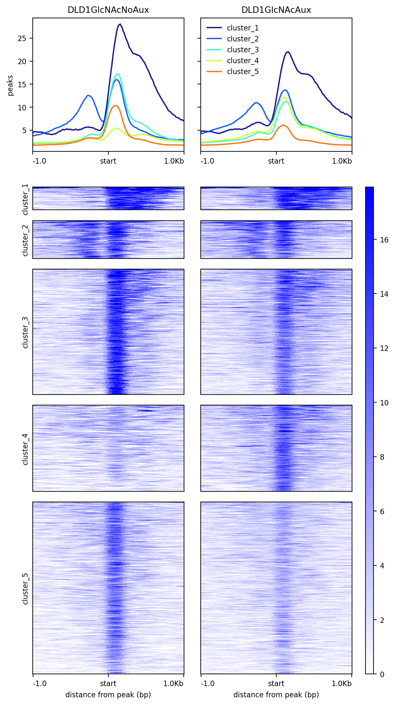
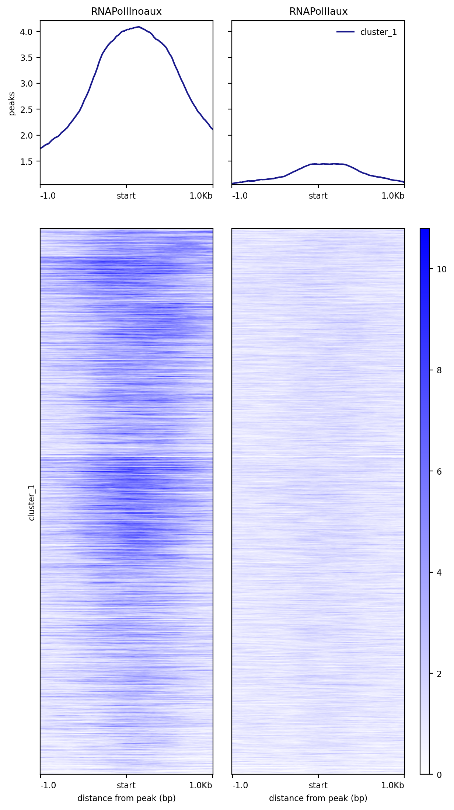

# Clustering of O-GlcNac before and after RNA Polymerase II removal reveals different functional categories

I. [Description](#description)  
II. [Data](#data)  
III. [Installation](#installation)  
IV. [Figure Generation](#figure-generation)  
V. [Pre-processing](#pre-processing)  
&nbsp;&nbsp; V.I. [Workflows](#workflows)  
&nbsp;&nbsp;&nbsp;&nbsp;&nbsp;&nbsp; VI.I.I. [ChIP-seq and CutnRun](#chip-seq-and-cutnrun)  
&nbsp;&nbsp; V.II. [Peak Detection](#peak-detection)  
&nbsp;&nbsp; V.I. [Peak Union](#peak-union)  


## Description

The comparison of O-GlcNac signal at 6,544 loci (union of replicate peaks) revealed 3 categories of loci (5 groups) in which the reponse of O-GlcNac occupancy to the removal of RNA Polymerase II (RNAPol II, see [fig4B](../B/README.md#description)) is different. Cluster 1-2-3 (284, 584, and 1490 peaks respectively) do not see major changes in O-GlcNac occupancy. The observed O-GlcNac signal is likely coming from other proteins than RNAPol II. Similarly, cluster 4 (1,200 peaks) is RNAPol II independent as poor signal is observed prior removal. However, the absence of RNAPol II enables the binding of proteins carrying O-GlcNac as an increase of signal is observed. It is tempting to speculate that this cluster has an actively transcribing RNAPol II, the absence of signal being explained by the lack of time for the antibody to catch O-GlcNac. Upon RNAPol II removal, the binding of repressing factors should decrease the production of RNAs. Strikingly, the figS3 shows a decrease in nascent rna signal at these loci. Cluster 5 (2,986 peaks) is the RNAPol II dependent one since it sees a decrease of O-GlcNac signal upon its removal. Overall, we can envision O-GlcNac as being a key component of transcription whether it is active or inactive. Perturbation of RNAPol II activity reveals a re-localization of O-GlcNac occupancy at thousands of loci.


## Data

```
#!/bin/bash

mkdir data

## The bigwigs of O-GlcNca before and after treatment by (Dox)/Auxin
wget https://www.ebi.ac.uk/biostudies/files/E-MTAB-14307/DLD1GlcNAcNoDoxAux_rep1.bw -P data/
wget https://www.ebi.ac.uk/biostudies/files/E-MTAB-14307/DLD1GlcNAcDoxAux_rep1.bw -P data/

## The bam files to perform the peak detection
wget https://www.ebi.ac.uk/biostudies/files/E-MTAB-14307/DLD1GlcNAcDoxAux_rep1.bam -P data/
wget https://www.ebi.ac.uk/biostudies/files/E-MTAB-14307/DLD1GlcNAcDoxAux_rep2.bam -P data/
wget https://www.ebi.ac.uk/biostudies/files/E-MTAB-14307/DLD1GlcNAcNoDoxAux_rep1.bam -P data/
wget https://www.ebi.ac.uk/biostudies/files/E-MTAB-14307/DLD1GlcNAcNoDoxAux_rep2.bam -P data/

## The peaks to perform the union
wget https://www.ebi.ac.uk/biostudies/files/E-MTAB-14307/DLD1GlcNAcNoDoxAux_rep1_peaks.gff -P data/
wget https://www.ebi.ac.uk/biostudies/files/E-MTAB-14307/DLD1GlcNAcNoDoxAux_rep2_peaks.gff -P data/
wget https://www.ebi.ac.uk/biostudies/files/E-MTAB-14307/DLD1GlcNAcDoxAux_rep1_peaks.gff -P data/
wget https://www.ebi.ac.uk/biostudies/files/E-MTAB-14307/DLD1GlcNAcDoxAux_rep2_peaks.gff -P data/

## The bigwigs of RNAPol II used as control
wget https://zenodo.org/records/12793186/files/RNAPolII_SRX11070611_control.bw -P data/
wget https://zenodo.org/records/12793186/files/RNAPolII_SRX11070613_auxin.bw -P data/

## The file of the union of the peaks
wget https://zenodo.org/records/12793186/files/union_OGlcNac_noauxaux-fig4C.bed -P data

## The coordinates of the peaks sorted in 5 groups
wget https://zenodo.org/records/12793186/files/peakscoord-fig4C.bed -P data
```


## Installation

Install conda following the instructions [here](https://conda.io/projects/conda/en/latest/user-guide/install/index.html). Using the recipe [fig4C.yml](fig4C.yml), run:

```
conda env create -n fig4c --file ./fig4C.yml
conda activate fig4c
```

## Figure Generation

Because of possible differences in seeds to perform the clustering, the matrix is built on the already sorted regions. The following computes a matrix of O-GlcNac without and with Auxin treatment. This matrix is used to plot a heatmap with K-means clustering with 5 groups (deeptools v3.5.5):

```
#!/bin/bash

mkdir results

NBCPU=1
FILENAME="heatmap_OGlcNac.png"

computeMatrix reference-point --regionsFileName data/peakscoord-fig4C.bed --scoreFileName data/DLD1GlcNAcNoDoxAux_rep1.bw data/DLD1GlcNAcDoxAux_rep1.bw --outFileName results/OGlcNacnoauxaux.mat --samplesLabel DLD1GlcNAcNoAux DLD1GlcNAcAux  --numberOfProcessors $NBCPU --referencePoint TSS  --beforeRegionStartLength 1000 --afterRegionStartLength 1000

plotHeatmap --matrixFile results/OGlcNacnoauxaux.mat --outFileName $FILENAME --plotFileFormat 'png' --dpi '200' --sortRegions 'keep' --sortUsing 'mean' --averageTypeSummaryPlot 'mean' --plotType 'lines' --missingDataColor 'black' --alpha '1.0' --colorList white,blue --xAxisLabel 'distance from peak (bp)' --yAxisLabel 'peaks' --heatmapWidth 7.5 --heatmapHeight 25.0 --whatToShow 'plot, heatmap and colorbar' --startLabel 'start' --endLabel 'TES' --refPointLabel 'start' --legendLocation 'best' --labelRotation '0'
```

You should obtain the raw figure:




Replace the groups 'cluster_2/3/4/5' in data/peakscoord-fig4C.bed to avoid visual separation of the groups:

```
sed "s/cluster_[2-5]/cluster_1/" data/peakscoord-fig4C.bed > results/peakscoord-fig4C-modified.bed
```

Using the sorted peak coordinates `peakscoord-fig4C.bed`, generate a matrix of RNAPol II signal before and after (Dox)/Auxin treatment:

```
FILENAME="heatmap_RNAPolII.png"

computeMatrix  reference-point --regionsFileName results/peakscoord-fig4C-modified.bed --scoreFileName data/RNAPolII_SRX11070611_control.bw data/RNAPolII_SRX11070613_auxin.bw --outFileName results/RNAPolIInoauxaux.mat --samplesLabel RNAPolIInoaux RNAPolIIaux --numberOfProcessors $NBCPU --referencePoint TSS --beforeRegionStartLength 1000 --afterRegionStartLength 1000

plotHeatmap --matrixFile results/RNAPolIInoauxaux.mat --outFileName $FILENAME --plotFileFormat 'png' --dpi '200' --sortRegions 'no' --sortUsing 'mean' --averageTypeSummaryPlot 'mean' --plotType 'lines' --missingDataColor 'black' --alpha '1.0' --colorList white,blue --xAxisLabel 'distance from peak (bp)' --yAxisLabel 'peaks' --heatmapWidth 7.5 --heatmapHeight 25.0 --whatToShow 'plot, heatmap and colorbar' --startLabel 'start' --endLabel 'TES' --refPointLabel 'start' --legendLocation 'best' --labelRotation '0'
```

You should obtain the raw figure:




## Pre-processing

### Workflows

#### ChIP-seq and CutnRun

The pre-processing was performed with the Galaxy workflows [OGlcNac_ChIP-SeqSEhg38.ga](../B/galaxy-workflow/Galaxy-Workflow-OGlcNac_ChIP-SeqSEhg38.ga). The .ga files can be imported in one own galaxy account.

Quality control was done with FastQC v0.11.9: `fastqc --outdir $outputfolder --threads $nbcpu --quiet --extract --kmers 7 -f 'fastq' $input.fastq.gz`.

Adapters and low quality reads were removed with trim-galore v0.4.3: `trim_galore --phred33 --quality 20 --stringency 1 -e 0.1 --length 20 --output_dir ./ $input.fastq.gz`.

Reads were aligned to hg38 with Bowtie 2.3.4.1 and the bam were sorted using samtools v1.9: `bowtie2 -p $nbcpu -x h.sapiens/hg38/hg38 -U $input.fastq.gz --sensitive --no-unal 2> $log |  samtools sort -@$nbcpu -O bam -o $output.bam`
 
Only primary alignments were kept using samtools v1.8: `samtools view -o $output.bam -h -b -q 20 -F 0x800 $input.bam`.

Reads not aligned to consensus chromosomes were excluded with samtools v1.9: `samtools view -o $output.bam -h -b $input.bam 'chr1' 'chr2' 'chr3' 'chr4' 'chr5' 'chr6' 'chr7' 'chr8' 'chr9' 'chr10' 'chr11' 'chr12' 'chr13' 'chr14' 'chr15' 'chr16' 'chr17' 'chr18' 'chr19' 'chr20' 'chr21' 'chr22' 'chrX' 'chrY'`.

The resulting bam file was sorted with samtools v1.9: `samtools sort -@ $nbcpu -m $addmemory"M" -O bam -T sorttmp $input.bam > $output.bam`

Duplicates were removed with picard v2.18.2: `picard MarkDuplicates INPUT=$input.bam OUTPUT=$output.bam METRICS_FILE=$metrics.txt REMOVE_DUPLICATES='true' ASSUME_SORTED='true'  DUPLICATE_SCORING_STRATEGY='SUM_OF_BASE_QUALITIES' OPTICAL_DUPLICATE_PIXEL_DISTANCE='100' VALIDATION_STRINGENCY='LENIENT' QUIET=true VERBOSITY=ERROR`

Bigwig files normalized by the genome size were generated with deeptools v3.0.2: `bamCoverage --numberOfProcessors $NBCPU --bam $input.bam --outFileName $output.bw --outFileFormat 'bigwig' --binSize 50 --normalizeUsing RPGC --effectiveGenomeSize 2701495761 --scaleFactor 1.0  --extendReads 150 --minMappingQuality '1'`


### Peak Detection

| Target | Broad | q-value | Duplicates Thres. | Tag size |
|--------|-------|---------|-------------------|----------|
| DLD1GlcNAcDoxAux_rep1 | NO | 0.04 | 7 | 82 |
| DLD1GlcNAcDoxAux_rep2 | NO | 0.04 | 7 | 82 |
| DLD1GlcNAcNoDoxAux_rep1 | NO | 0.04 | 6 | 82 |
| DLD1GlcNAcNoDoxAux_rep2 | NO | 0.04 | 7 | 82 |


* Macs2 v2.2.7.1 Narrow: `macs2 callpeak -t $input.bam -c NA -n $expname --outdir $outfold -f BAM -g 2.9e9 -s $tagsize -q $qvalue --nomodel --extsize 150 --keep-dup $dupthres`


### Peak Union

Generate the bed file of the union of peaks by running:

```
Rscript union.R
```

The script should give the output:

```
Reading peak files
Reducing intervals
The union returned 6,544 peaks
Writing results/union_OGlcNac_noauxaux-fig4C.bed
```
