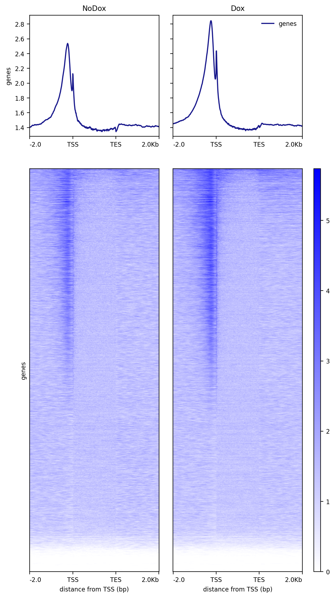

# RNA Polymerase II and O-GlcNac co-localize at gene promoters in human DLD-1 cells

I. [Description](#description)  
II. [Data](#data)  
III. [Installation](#installation)  
IV. [Figure Generation](#figure-generation)  
V. [Pre-processing](#pre-processing)  
&nbsp;&nbsp; V.I. [Workflows](#workflows)  
&nbsp;&nbsp;&nbsp;&nbsp;&nbsp;&nbsp; VI.I.I. [ChIP-seq and CutnRun](#cutnrun)  

## Description

In [fig1](../../figure1/E/README.md), we observed that the potential candidates underlying the O-GlcNac signal are related to the RNA Polymerase II (RNA Pol II). We thought investigating further the relationship between O-GlcNac and the transcriptional machinery by removing RNA Pol II. We took advantage of an existing system in Human colon adenocarcinoma DLD-1 cells. These cells express OsTIR and a cassette encoding mini-AID (mAID) and fluorescent protein mClover (mAID+mClover) at the initiation site of the endogenous Rpb1 gene locus (POLR2A) (Nagashima 2019). Stimulation by doxocyclin enables to remove RNAPol II.

The heatmap of binding values of RNA Polymerase II and O-GlcNac shows a global colocalization at the 21,519 GRCh38 Ensembl genes. Note that upon RNAPol II removal by doxocyclin induction, O-GlcNac signal remains globally unaffected. As conveyed in the following analysis, we hypothetize that O-GlcNac might be maintained by the recruitment of other O-GlcNacylated proteins at gene promoters.

## Data

```
#!/bin/bash

mkdir data

## The bigwig files of RNAPol II and O-GlcNac before and after induction
wget https://www.ebi.ac.uk/biostudies/files/E-MTAB-14307/DLD1GlcNAcDoxAux_rep1.bw -P data/
wget https://www.ebi.ac.uk/biostudies/files/E-MTAB-14307/DLD1GlcNAcNoDoxAux_rep1.bw -P data/
wget https://zenodo.org/records/12793186/files/RNApolymeraseII_SRX10580013.bw -P data/

## The gene annotations Homo_sapiens.GRCh38.110.chr_march2024_filtered.bed
wget https://zenodo.org/records/12793186/files/Homo_sapiens.GRCh38.110.chr_march2024_filtered.tar.gz  -P data/
cd data && tar -xvzf Homo_sapiens.GRCh38.110.chr_march2024_filtered.tar.gz && rm Homo_sapiens.GRCh38.110.chr_march2024_filtered.tar.gz && cd ..

## The peaks coordinates after decreasing sorting of RNAPol II (panel number has been change after submission)
wget https://zenodo.org/records/12793186/files/peakscoord-fig4B.bed -P data/
```

## Installation

Install conda following the instructions [here](https://conda.io/projects/conda/en/latest/user-guide/install/index.html). Using the recipe [fig4C.yml](fig4C.yml), run:

```
conda env create -n fig4C --file ./fig4C.yml
conda activate fig4C
```

## Figure generation

Generate a matrix with the RNAPol II bigwig using the coordinates of the Ensembl genes and plot a heatmap in descending order (deeptools v3.5.5):

```
#!/bin/bash

mkdir results

## Define the number of CPUs
NBCPU=1

## Build the deeptools matrix
computeMatrix scale-regions --regionsFileName data/Homo_sapiens.GRCh38.110.chr_march2024_filtered.bed --scoreFileName data/RNApolymeraseII_SRX10580013.bw --outFileName results/polII.mat --samplesLabel RNAPol_II --numberOfProcessors $NBCPU --regionBodyLength 2000 --beforeRegionStartLength 2000 --afterRegionStartLength 2000 --unscaled5prime 0 --unscaled3prime 0

## Plot the RNAPol II signal using decreasing sorting
FILENAME="heatmap_polII.png"

plotHeatmap --matrixFile results/polII.mat --outFileName results/$FILENAME --plotFileFormat 'png' --outFileSortedRegions results/peakscoord-fig4B.bed --dpi '200' --sortRegions 'descend' --sortUsing 'mean' --averageTypeSummaryPlot 'mean' --plotType 'lines' --missingDataColor 'black' --alpha '1.0' --colorList white,blue --xAxisLabel 'distance from TSS (bp)' --yAxisLabel 'genes' --heatmapWidth 7.5 --heatmapHeight 25.0 --whatToShow 'plot, heatmap and colorbar' --startLabel 'TSS' --endLabel 'TES' --refPointLabel 'TSS' --samplesLabel RNAPolII --legendLocation 'best' --labelRotation '0'
```

You should obtain the raw figure:


Using the sorted peak coordinates `peakscoord-fig4B.bed`, generate a matrix of O-GlcNac signal before and after (Dox)/Auxin treatment:

```
computeMatrix scale-regions --regionsFileName results/peakscoord-fig4B.bed --scoreFileName data/DLD1GlcNAcNoDoxAux_rep1.bw data/DLD1GlcNAcDoxAux_rep1.bw --outFileName results/OGlcNac.mat --samplesLabel GlcNAcNoDox GlcNAcDox --numberOfProcessors $NBCPU --regionBodyLength 2000 --beforeRegionStartLength 2000 --afterRegionStartLength 2000  --unscaled5prime 0 --unscaled3prime 0
```

The matrix is already sorted because it followed the order of `peakscoord-fig4B.bed`. Remains plotting the signal without performing sorting:

```
FILENAME="heatmap_OGlcNac.png"

plotHeatmap --matrixFile results/OGlcNac.mat --outFileName results/$FILENAME  --plotFileFormat 'png' --dpi '200' --sortRegions 'no' --sortUsing 'mean' --averageTypeSummaryPlot 'mean' --plotType 'lines' --missingDataColor 'black' --alpha '1.0' --colorList white,blue --xAxisLabel 'distance from TSS (bp)' --yAxisLabel 'genes' --heatmapWidth 7.5 --heatmapHeight 25.0 --whatToShow 'plot, heatmap and colorbar' --startLabel 'TSS' --endLabel 'TES' --refPointLabel 'TSS' --samplesLabel NoDox Dox --legendLocation 'best' --labelRotation '0'
```

You should obtain the following heatmaps:




## Pre-processing

### Workflows

#### ChIP-seq and CutnRun

The pre-processing was performed with the Galaxy workflows [OGlcNac_ChIP-SeqSEhg38.ga](galaxy-workflow/Galaxy-Workflow-OGlcNac_ChIP-SeqSEhg38.ga). The .ga files can be imported in one own galaxy account.

Quality control was done with FastQC v0.11.9: `fastqc --outdir $outputfolder --threads $nbcpu --quiet --extract --kmers 7 -f 'fastq' $input.fastq.gz`.

Adapters and low quality reads were removed with trim-galore v0.4.3: `trim_galore --phred33 --quality 20 --stringency 1 -e 0.1 --length 20 --output_dir ./ $input.fastq.gz`.

Reads were aligned to hg38 with Bowtie 2.3.4.1 and the bam were sorted using samtools v1.9: `bowtie2 -p $nbcpu -x h.sapiens/hg38/hg38 -U $input.fastq.gz --sensitive --no-unal 2> $log |  samtools sort -@$nbcpu -O bam -o $output.bam`
 
Only primary alignments were kept using samtools v1.8: `samtools view -o $output.bam -h -b -q 20 -F 0x800 $input.bam`.

Reads not aligned to consensus chromosomes were excluded with samtools v1.9: `samtools view -o $output.bam -h -b $input.bam 'chr1' 'chr2' 'chr3' 'chr4' 'chr5' 'chr6' 'chr7' 'chr8' 'chr9' 'chr10' 'chr11' 'chr12' 'chr13' 'chr14' 'chr15' 'chr16' 'chr17' 'chr18' 'chr19' 'chr20' 'chr21' 'chr22' 'chrX' 'chrY'`.

The resulting bam file was sorted with samtools v1.9: `samtools sort -@ $nbcpu -m $addmemory"M" -O bam -T sorttmp $input.bam > $output.bam`

Duplicates were removed with picard v2.18.2: `picard MarkDuplicates INPUT=$input.bam OUTPUT=$output.bam METRICS_FILE=$metrics.txt REMOVE_DUPLICATES='true' ASSUME_SORTED='true'  DUPLICATE_SCORING_STRATEGY='SUM_OF_BASE_QUALITIES' OPTICAL_DUPLICATE_PIXEL_DISTANCE='100' VALIDATION_STRINGENCY='LENIENT' QUIET=true VERBOSITY=ERROR`

Bigwig files normalized by the genome size were generated with deeptools v3.0.2: `bamCoverage --numberOfProcessors $NBCPU --bam $input.bam --outFileName $output.bw --outFileFormat 'bigwig' --binSize 50 --normalizeUsing RPGC --effectiveGenomeSize 2701495761 --scaleFactor 1.0  --extendReads 150 --minMappingQuality '1'`
