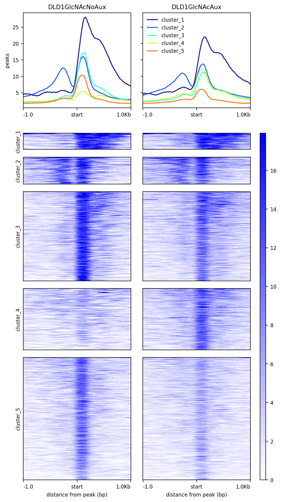
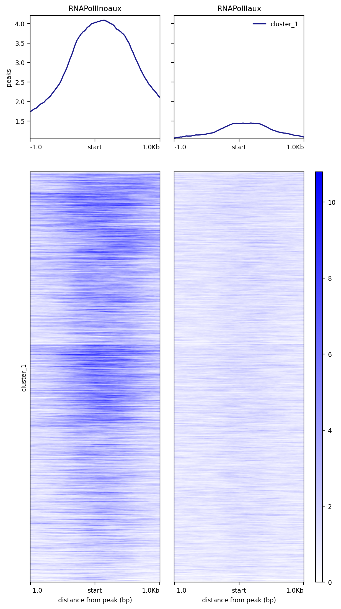

# Clustering of O-GlcNac before and after RNA Polymerase II removal reveals different functional categories

I. [Description](#description)  
II. [Data](#data)  
III. [Installation](#installation)  
IV. [Figure Generation](#figure-generation)  
V. [Pre-processing](#pre-processing)  
&nbsp;&nbsp; V.I. [Data](#data)  
&nbsp;&nbsp; V.II. [Workflow](#workflow)  
&nbsp;&nbsp; V.III. [Peak Detection](#peak-detection)  
&nbsp;&nbsp; V.IV. [Peak Union](#peak-union)  


## Description

Further clustering analysis of the O-GlcNAc signal revealed five distinct groups of loci (totaling 6,544) whose glycosylation patterns are influenced by RNA Pol II ([Fig. 4C](../C/README.md#description)). These changes in O-GlcNAc patterns can be categorized into three main groups: (1) Clusters 1-2-3 (284, 584, and 1490 peaks respectively) show no significant changes in O-GlcNAc occupancy, suggesting they are likely bound by O-GlcNAcylated proteins other than RNA Pol II. Genes in cluster 2 encode proteins involved in histone methylation and transcription coactivator activity. (2) Similarly, cluster 4 (1,200 peaks) appears to have O-GlcNAc levels that are independent of RNA Pol II, as evidenced by the low O-GlcNAc signal in presence of RNA Pol II. It is plausible that these loci have an actively transcribing O-GlcNacylated RNA Pol II, but the lack of signal could be due to insufficient time for the antibody to detect O-GlcNac. Another possibility is that at these loci RNA Pol II lacks O-GlcNAc on its CTD. Either scenario would result in reduced RNA production following RNA Pol II removal. Strikingly, Fig. S3 shows a decrease in nascent RNA production at these loci. Thus, we conclude that the absence of RNA Pol II allows other O-GlcNAc carrying proteins to bind, as indicated by an increase in O-GlcNac signal following Dox/Aux induction. Genes in cluster 4 encode proteins specifically associated with RNA Polymerase activity, suggesting that O-GlcNAc is unnecessary to sustain their expression. (3) Cluster 5 (2,986 peaks) consists of genes where O-GlcNAc levels are dependent on RNA Pol II. Here, glycosylation levels decrease upon RNA Pol II depletion, and the residual O-GlcNAc signal post-RNA Pol II degradation likely originates from other glycosylated factors associated with the transcription machinery. GSEA of cluster 5 identifies two groups of genes associated with transcription initiation.

## Data

```
#!/bin/bash

mkdir data

## The bigwigs of O-GlcNca before and after treatment by (Dox)/Auxin
wget https://www.ebi.ac.uk/biostudies/files/E-MTAB-14307/DLD1GlcNAcNoDoxAux_rep1.bw -P data/
wget https://www.ebi.ac.uk/biostudies/files/E-MTAB-14307/DLD1GlcNAcDoxAux_rep1.bw -P data/

## The bigwigs of RNAPol II used as control
wget https://zenodo.org/records/12793186/files/RNAPolII_SRX11070611_control.bw -P data/
wget https://zenodo.org/records/12793186/files/RNAPolII_SRX11070613_auxin.bw -P data/

## The file of the union of the peaks (panel number has been change after submission)
wget https://zenodo.org/records/12793186/files/union_OGlcNac_noauxaux-fig4C.bed -P data
```


## Installation

Install conda following the instructions [here](https://conda.io/projects/conda/en/latest/user-guide/install/index.html). Using the recipe [fig4D.yml](fig4D.yml), run:

```
conda env create -n fig4D --file ./fig4D.yml
conda activate fig4D
```

## Figure Generation

Because of possible differences in seeds to perform the clustering, the matrix is built on the already sorted regions. The following computes a matrix of O-GlcNac without and with Auxin treatment. This matrix is used to plot a heatmap with K-means clustering with 5 groups (deeptools v3.5.5):

```
#!/bin/bash

mkdir results

NBCPU=1
FILENAME="heatmap_OGlcNac.png"

computeMatrix reference-point --regionsFileName data/peakscoord-fig4C.bed --scoreFileName data/DLD1GlcNAcNoDoxAux_rep1.bw data/DLD1GlcNAcDoxAux_rep1.bw --outFileName results/OGlcNacnoauxaux.mat --samplesLabel DLD1GlcNAcNoAux DLD1GlcNAcAux  --numberOfProcessors $NBCPU --referencePoint TSS  --beforeRegionStartLength 1000 --afterRegionStartLength 1000

plotHeatmap --matrixFile results/OGlcNacnoauxaux.mat --outFileName $FILENAME --plotFileFormat 'png' --dpi '200' --sortRegions 'keep' --sortUsing 'mean' --averageTypeSummaryPlot 'mean' --plotType 'lines' --missingDataColor 'black' --alpha '1.0' --colorList white,blue --xAxisLabel 'distance from peak (bp)' --yAxisLabel 'peaks' --heatmapWidth 7.5 --heatmapHeight 25.0 --whatToShow 'plot, heatmap and colorbar' --startLabel 'start' --endLabel 'TES' --refPointLabel 'start' --legendLocation 'best' --labelRotation '0'
```

You should obtain the raw figure:




Replace the groups 'cluster_2/3/4/5' in data/peakscoord-fig4C.bed to avoid visual separation of the groups:

```
sed "s/cluster_[2-5]/cluster_1/" data/peakscoord-fig4C.bed > results/peakscoord-fig4C-modified.bed
```

Using the sorted peak coordinates `peakscoord-fig4C.bed`, generate a matrix of RNAPol II signal before and after (Dox)/Auxin treatment:

```
FILENAME="heatmap_RNAPolII.png"

computeMatrix  reference-point --regionsFileName results/peakscoord-fig4C-modified.bed --scoreFileName data/RNAPolII_SRX11070611_control.bw data/RNAPolII_SRX11070613_auxin.bw --outFileName results/RNAPolIInoauxaux.mat --samplesLabel RNAPolIInoaux RNAPolIIaux --numberOfProcessors $NBCPU --referencePoint TSS --beforeRegionStartLength 1000 --afterRegionStartLength 1000

plotHeatmap --matrixFile results/RNAPolIInoauxaux.mat --outFileName $FILENAME --plotFileFormat 'png' --dpi '200' --sortRegions 'no' --sortUsing 'mean' --averageTypeSummaryPlot 'mean' --plotType 'lines' --missingDataColor 'black' --alpha '1.0' --colorList white,blue --xAxisLabel 'distance from peak (bp)' --yAxisLabel 'peaks' --heatmapWidth 7.5 --heatmapHeight 25.0 --whatToShow 'plot, heatmap and colorbar' --startLabel 'start' --endLabel 'TES' --refPointLabel 'start' --legendLocation 'best' --labelRotation '0'
```

You should obtain the raw figure:




## Pre-processing

### Data

To obtain the fastq files see [Fig. 4B](../B/README.md#data-1).

Here are some processed files.

```
## The bam files to perform the peak detection
wget https://www.ebi.ac.uk/biostudies/files/E-MTAB-14307/DLD1GlcNAcDoxAux_rep1.bam -P data/
wget https://www.ebi.ac.uk/biostudies/files/E-MTAB-14307/DLD1GlcNAcDoxAux_rep2.bam -P data/
wget https://www.ebi.ac.uk/biostudies/files/E-MTAB-14307/DLD1GlcNAcNoDoxAux_rep1.bam -P data/
wget https://www.ebi.ac.uk/biostudies/files/E-MTAB-14307/DLD1GlcNAcNoDoxAux_rep2.bam -P data/

## The peaks to perform the union
wget https://www.ebi.ac.uk/biostudies/files/E-MTAB-14307/DLD1GlcNAcNoDoxAux_rep1_peaks.gff -P data/
wget https://www.ebi.ac.uk/biostudies/files/E-MTAB-14307/DLD1GlcNAcNoDoxAux_rep2_peaks.gff -P data/
wget https://www.ebi.ac.uk/biostudies/files/E-MTAB-14307/DLD1GlcNAcDoxAux_rep1_peaks.gff -P data/
wget https://www.ebi.ac.uk/biostudies/files/E-MTAB-14307/DLD1GlcNAcDoxAux_rep2_peaks.gff -P data/

## The coordinates of the peaks sorted in 5 groups (panel number has been change after submission)
wget https://zenodo.org/records/12793186/files/peakscoord-fig4C.bed -P data
```

### Workflow

The pre-processing was performed with the Galaxy workflows [OGlcNac_ChIP-SeqSEhg38.ga](../B/galaxy-workflow/Galaxy-Workflow-OGlcNac_ChIP-SeqSEhg38.ga). The .ga files can be imported in one own galaxy account.

Quality control was done with FastQC v0.11.9: `fastqc --outdir $outputfolder --threads $nbcpu --quiet --extract --kmers 7 -f 'fastq' $input.fastq.gz`.

Adapters and low quality reads were removed with trim-galore v0.4.3: `trim_galore --phred33 --quality 20 --stringency 1 -e 0.1 --length 20 --output_dir ./ $input.fastq.gz`.

Reads were aligned to hg38 with Bowtie 2.3.4.1 and the bam were sorted using samtools v1.9: `bowtie2 -p $nbcpu -x h.sapiens/hg38/hg38 -U $input.fastq.gz --sensitive --no-unal 2> $log |  samtools sort -@$nbcpu -O bam -o $output.bam`
 
Only primary alignments were kept using samtools v1.8: `samtools view -o $output.bam -h -b -q 20 -F 0x800 $input.bam`.

Reads not aligned to consensus chromosomes were excluded with samtools v1.9: `samtools view -o $output.bam -h -b $input.bam 'chr1' 'chr2' 'chr3' 'chr4' 'chr5' 'chr6' 'chr7' 'chr8' 'chr9' 'chr10' 'chr11' 'chr12' 'chr13' 'chr14' 'chr15' 'chr16' 'chr17' 'chr18' 'chr19' 'chr20' 'chr21' 'chr22' 'chrX' 'chrY'`.

The resulting bam file was sorted with samtools v1.9: `samtools sort -@ $nbcpu -m $addmemory"M" -O bam -T sorttmp $input.bam > $output.bam`

Duplicates were removed with picard v2.18.2: `picard MarkDuplicates INPUT=$input.bam OUTPUT=$output.bam METRICS_FILE=$metrics.txt REMOVE_DUPLICATES='true' ASSUME_SORTED='true'  DUPLICATE_SCORING_STRATEGY='SUM_OF_BASE_QUALITIES' OPTICAL_DUPLICATE_PIXEL_DISTANCE='100' VALIDATION_STRINGENCY='LENIENT' QUIET=true VERBOSITY=ERROR`

Bigwig files normalized by the genome size were generated with deeptools v3.0.2: `bamCoverage --numberOfProcessors $NBCPU --bam $input.bam --outFileName $output.bw --outFileFormat 'bigwig' --binSize 50 --normalizeUsing RPGC --effectiveGenomeSize 2701495761 --scaleFactor 1.0  --extendReads 150 --minMappingQuality '1'`


### Peak Detection

| Target | Broad | q-value | Duplicates Thres. | Tag size |
|--------|-------|---------|-------------------|----------|
| DLD1GlcNAcDoxAux_rep1 | NO | 0.04 | 7 | 82 |
| DLD1GlcNAcDoxAux_rep2 | NO | 0.04 | 7 | 82 |
| DLD1GlcNAcNoDoxAux_rep1 | NO | 0.04 | 6 | 82 |
| DLD1GlcNAcNoDoxAux_rep2 | NO | 0.04 | 7 | 82 |


* Macs2 v2.2.7.1 Narrow: `macs2 callpeak -t $input.bam -c NA -n $expname --outdir $outfold -f BAM -g 2.9e9 -s $tagsize -q $qvalue --nomodel --extsize 150 --keep-dup $dupthres`


### Peak Union

Generate the bed file of the union of peaks by running:

```
Rscript script/union.R
```

The script should give the output:

```
Reading peak files
Reducing intervals
The union returned 6,544 peaks
Writing results/union_OGlcNac_noauxaux-fig4C.bed
```
