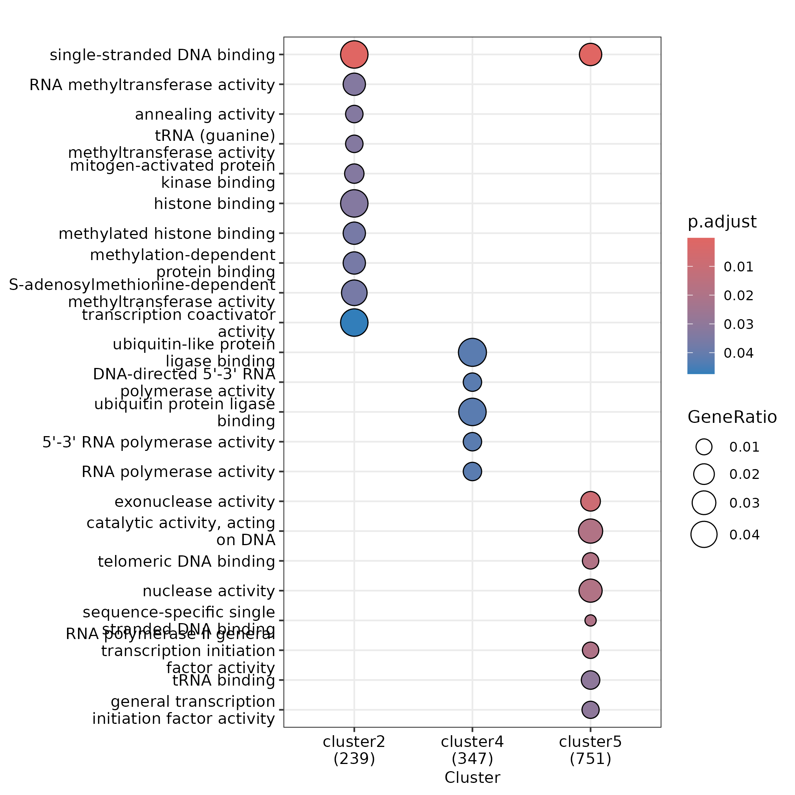
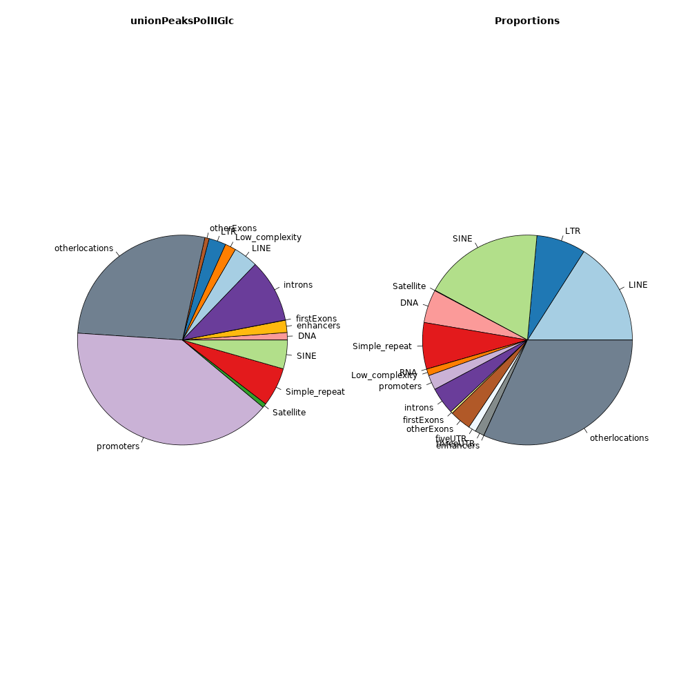
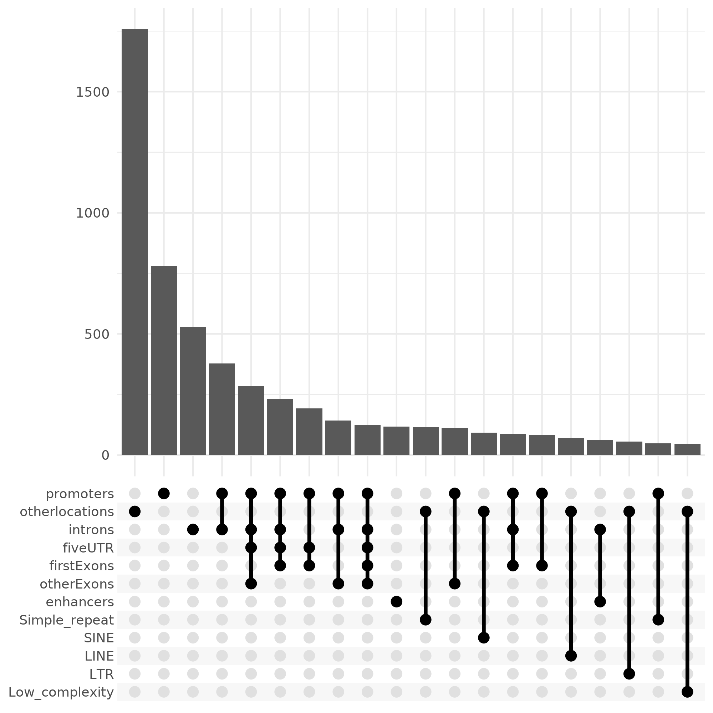

# Geneset Enrichment of the three clusters presenting different O-GlcNac occupancy outcomes upon RNA Polymerase II degradation

I. [Description](#description)  
II. [Data](#data)  
III. [Installation](#installation)  
IV. [Figure Generation](#figure-generation)  
V. [Pre-processing](#pre-processing)  
&nbsp;&nbsp; V.I. [Genomic Repartition](#genomic-repartition)  
&nbsp;&nbsp; V.II. [Genomic Repartition by Clusters](#genomic-repartition)  
&nbsp;&nbsp; V.III. [Genes from Compartments](#genomic-repartition)  

## Description

Geneset enrichment analysis of the 5 clusters defined in [fig4D](../D/README.md). Genes overlapping one or more O-GlcNac peaks were retrieved as input. Cluster 1 and 3 did not give any enrichment. Cluster 2 (239 genes/584 peaks) is mainly enriched for genes coding for histone methyltransferases and transcription co-activators. Cluster 4 (347 genes/1,200 peaks) gained O-GlcNac on genes coding for proteins linked to the RNA Polymerase II activity. Cluster 5 (751 genes/2,986 peaks) gave an enrichment for general transcription initiation factor activity.


## Data

```
#!/bin/bash

mkdir data

wget https://zenodo.org/records/12793186/files/fig4D_genes_cluster1.gff  -P data/
wget https://zenodo.org/records/12793186/files/fig4D_genes_cluster2.gff  -P data/
wget https://zenodo.org/records/12793186/files/fig4D_genes_cluster3.gff  -P data/
wget https://zenodo.org/records/12793186/files/fig4D_genes_cluster4.gff -P data/
wget https://zenodo.org/records/12793186/files/fig4D_genes_cluster5.gff  -P data/

## The coordinates of the peaks sorted in 5 groups (panel number has been change after submission)
wget https://zenodo.org/records/12793186/files/peakscoord-fig4C.bed -P data

## The file of the union of the peaks used for preprocessing (panel number has been change after submission)
wget https://zenodo.org/records/12793186/files/union_OGlcNac_noauxaux-fig4C.bed -P data

## The repeatmasker annotations used for preprocessing
wget https://zenodo.org/records/12793186/files/repeatshg38.tar.gz -P data/
cd data/ && tar -xvzf repeatshg38.tar.gz && rm repeatshg38.tar.gz && cd ..

## The DLD1 enhancer coordinates used for preprocessing
wget https://zenodo.org/records/12793186/files/enhancerAtlas2_DLD1.gff -P data/
```

## Installation


Install conda following the instructions [here](https://conda.io/projects/conda/en/latest/user-guide/install/index.html). Using the recipe [fig4F.yml](fig4F.yml), run:

```
conda env create -n fig4f --file ./fig4F.yml
conda activate fig4f
```

## Figure generation

Run the script:

```
Rscript scripts/enrichmentanalysis.R
```

The script should output:

```
Reading gff files and return conversion table
'select()' returned 1:many mapping between keys and columns
'select()' returned 1:many mapping between keys and columns
'select()' returned 1:many mapping between keys and columns
'select()' returned 1:many mapping between keys and columns
'select()' returned 1:many mapping between keys and columns
Warning messages:
1: In clusterProfiler::bitr(fi[, 3], fromType = "SYMBOL", toType = c("SYMBOL",  :
  9.35% of input gene IDs are fail to map...
2: In clusterProfiler::bitr(fi[, 3], fromType = "SYMBOL", toType = c("SYMBOL",  :
  6.47% of input gene IDs are fail to map...
3: In clusterProfiler::bitr(fi[, 3], fromType = "SYMBOL", toType = c("SYMBOL",  :
  5.79% of input gene IDs are fail to map...
4: In clusterProfiler::bitr(fi[, 3], fromType = "SYMBOL", toType = c("SYMBOL",  :
  7.35% of input gene IDs are fail to map...
5: In clusterProfiler::bitr(fi[, 3], fromType = "SYMBOL", toType = c("SYMBOL",  :
  5.6% of input gene IDs are fail to map...
Defining background
### No background provided
Retrieving info from biomart
Connecting to biomart
# Attempt 1/5 # Connection to Ensembl ... 
Connected with success.
	 Retrieving gene info
# Attempt 1/5 # Retrieving information about genes from biomaRt ...
Information retrieved with success.
Filtering out non-canonical chromosomes from genesinfo
Removing 7557/70606 annotations with non canonical chromosomes
Creating the input list of entrezID
Creating the entrezID-symbol table
Performing clusters comparison on molecular function
Output the dotplot of the comparison into ../results/
```

You should obtain the raw figure:




### Pre-processing

#### Genomic Repartition


Perform the genomic repartition of the union of the glc peaks for each replicate. For details on the union of peaks see [fig4C](../C/README.md#peak-union).

```
Rscript scripts/genomicRepartition.R
```

The script should output:

```
Filtering database chromosomes
Building list of repeats (this might take a while)
	 Processing /g/boulard/Projects/O-N-acetylglucosamine/data/Annotations/human/hg38/repeatmasker/classes/LINE.gff
	 Processing /g/boulard/Projects/O-N-acetylglucosamine/data/Annotations/human/hg38/repeatmasker/classes/LTR.gff
	 Processing /g/boulard/Projects/O-N-acetylglucosamine/data/Annotations/human/hg38/repeatmasker/classes/SINE.gff
	 Processing /g/boulard/Projects/O-N-acetylglucosamine/data/Annotations/human/hg38/repeatmasker/classes/Satellite.gff
	 Processing /g/boulard/Projects/O-N-acetylglucosamine/data/Annotations/human/hg38/repeatmasker/classes/DNA.gff
	 Processing /g/boulard/Projects/O-N-acetylglucosamine/data/Annotations/human/hg38/repeatmasker/classes/Simple_repeat.gff
	 Processing /g/boulard/Projects/O-N-acetylglucosamine/data/Annotations/human/hg38/repeatmasker/classes/RNA.gff
	 Processing /g/boulard/Projects/O-N-acetylglucosamine/data/Annotations/human/hg38/repeatmasker/classes/Low_complexity.gff
	 Retrieving genomic features: Promoter, 5' UTR, 3' UTR, Exon, Intron, Downstream
	 Retrieving first exons
	 Retrieving enhancers
	 Processing /g/boulard/Projects/O-N-acetylglucosamine/data/Annotations/human/hg38/enhancerAtlas2/DLD1.gff
	 Building list of annotations
The list was built in:
Time difference of 4.017577 mins
Connecting to biomart
# Attempt 1/5 # Connection to Ensembl ... 
Connected with success.
Determining proportions on each target category for each query file
     Processing unionPeaksPolIIGlc
		 Building GR with query file
	 Processing /g/boulard/Projects/O-N-acetylglucosamine/analysis/makeunion/sept2023/human/glcPolII_samples1-2-3-4/union_glcPolII_sept2023.gff
		 Performing overlap on the different categories
		 Plotting piechart
Plotting upset
Saving 6.67 x 6.67 in image
	 Saving peaks per category
# Attempt 1/5 # Retrieving information about genes from biomaRt ...
Information retrieved with success.
```

You should obtain the raw figures:





#### Genomic Repartition by Clusters


The files produced in the results folder are then used to determine the genomic repartition of the peaks of each cluster:

```
Rscript scripts/genomicRepartitionClusters.R
```

The script should output:

```
Reading the peaks coordinates of the heatmap and spliting by clusters
Reading peaks coord for each compartment of the genomic repartition generated previously
Reading the coordinates of the union of the replicate peaks
For each cluster group in coordgrouplist, retrieve the genomic compartment
	 Processing cluster_1
	 Writing files to results/cluster_1-compartmentsgff
		DNA: 2 elements
		enhancers: 2 elements
		introns: 21 elements
		LINE: 6 elements
		Low_complexity: 6 elements
		LTR: 3 elements
		otherLocations: 87 elements
		promoters: 106 elements
		Satellite: 7 elements
		Simple_repeat: 19 elements
		SINE: 17 elements
	 Processing cluster_2
	 Writing files to results/cluster_2-compartmentsgff
		DNA: 5 elements
		enhancers: 14 elements
		firstExons: 1 elements
		introns: 36 elements
		LINE: 12 elements
		Low_complexity: 7 elements
		LTR: 8 elements
		otherExons: 3 elements
		otherLocations: 112 elements
		promoters: 302 elements
		Satellite: 2 elements
		Simple_repeat: 37 elements
		SINE: 32 elements
	 Processing cluster_3
1 peaks do not have a ref in the union
	 Writing files to results/cluster_3-compartmentsgff
		DNA: 19 elements
		enhancers: 27 elements
		introns: 119 elements
		LINE: 56 elements
		Low_complexity: 22 elements
		LTR: 34 elements
		otherExons: 7 elements
		otherLocations: 379 elements
		promoters: 585 elements
		Satellite: 7 elements
		Simple_repeat: 91 elements
		SINE: 57 elements
	 Processing cluster_4
	 Writing files to results/cluster_4-compartmentsgff
		DNA: 13 elements
		enhancers: 11 elements
		introns: 86 elements
		LINE: 46 elements
		Low_complexity: 25 elements
		LTR: 20 elements
		otherExons: 13 elements
		otherLocations: 327 elements
		promoters: 473 elements
		Satellite: 4 elements
		Simple_repeat: 69 elements
		SINE: 44 elements
	 Processing cluster_5
	 Writing files to results/cluster_5-compartmentsgff
		DNA: 31 elements
		enhancers: 64 elements
		introns: 333 elements
		LINE: 111 elements
		Low_complexity: 46 elements
		LTR: 96 elements
		otherExons: 19 elements
		otherLocations: 780 elements
		promoters: 1023 elements
		Satellite: 20 elements
		Simple_repeat: 148 elements
		SINE: 126 elements
```


#### Genes from Compartments

By performing an overlap of the promoter coordinates of each cluster with the Ensembl gene annotations, we retrieve the input files of cluster profiler to generate the main figure:

```
Rscript scripts/overlapClustersEnsemblGenes.R
```

The script should output:

```
Reading gff input and converting to genomicranges Data
	Removing 2/21519 duplicated ranges
Performing overlap of each cluster with ensembl annotations
         Performing overlap for cluster1
         Converting result to gff format
                 Removing 5/112 duplicated ensembl genes.
         The number of genes for cluster1 is 107
         Writing coordinates to results/cluster_1-compartmentsgff/promoters_vs_ensemblgenes
         Performing overlap for cluster2
         Converting result to gff format
                 Removing 27/305 duplicated ensembl genes.
         The number of genes for cluster2 is 278
         Writing coordinates to results/cluster_2-compartmentsgff/promoters_vs_ensemblgenes/
         Performing overlap for cluster3
         Converting result to gff format
                 Removing 14/549 duplicated ensembl genes.
         The number of genes for cluster3 is 535
         Writing coordinates to results/cluster_3-compartmentsgff/promoters_vs_ensemblgenes
         Performing overlap for cluster4
         Converting result to gff format
                 Removing 10/418 duplicated ensembl genes.
         The number of genes for cluster4 is 408
         Writing coordinates to results/cluster_4-compartmentsgff/promoters_vs_ensemblgenes
         Performing overlap for cluster5
         Converting result to gff format
                 Removing 36/875 duplicated ensembl genes.
         The number of genes for cluster5 is 839
         Writing coordinates to resuls/cluster_5-compartmentsgff/promoters_vs_ensemblgenes
```

One could have noticed that the numbers are different than what is described in the Description section. This is because some of the retrieved genes did not contribute to the enrichment of a gene set. Indeed, the numbers of the submitted list of genes to cluster profiler are higher than what is observed on the figure.

```
## Overlap output
The number of genes for cluster2 is 278
The number of genes for cluster4 is 408
The number of genes for cluster5 is 839

## Cluster profiler output
Cluster 2 (239 genes/584 peaks)
Cluster 4 (347 genes/1,200 peaks)
Cluster 5 (751 genes/2,986 peaks)
```
